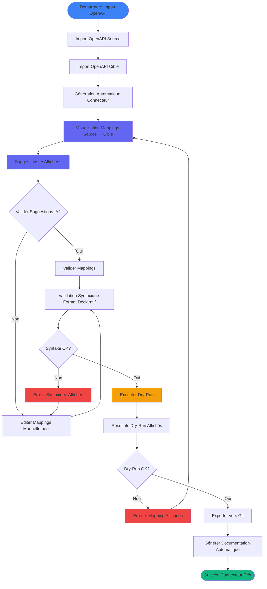

# UX Design Specification Cannectors

**Author:** Cano
**Date:** 2026-01-10

---

<!-- UX design content will be appended sequentially through collaborative workflow steps -->

## Executive Summary

### Project Vision

**Cannectors** est une plateforme SaaS B2B developer-first qui automatise la génération de connecteurs déclaratifs explicites entre systèmes métiers à partir de spécifications OpenAPI, avec IA assistive pour le mapping des données.

L'innovation réside dans la combinaison unique de :
- **Connecteurs déclaratifs explicites** : Format DSL/configuration explicite (YAML/JSON) définissant mappings, transformations et logique de connecteur, lisible, versionnable et éditable par le développeur
- **Runtime portable et déterministe** : Runtime unique interprétant les déclarations, portable (Go/Rust), déterministe, versionné et maintenu par la plateforme
- **IA uniquement assistive** : IA utilisée uniquement pour assister la génération des déclarations (suggestions de mapping, détection de patterns), pas pour l'exécution, garantissant un runtime déterministe et contrôlable
- **Contrôle développeur total** : Le développeur garde le contrôle complet sur la logique métier, la sécurité et l'exécution via les déclarations explicites

L'objectif principal : Réduire le temps de création de connecteurs de 2-5 jours à 1-4 heures pour un connecteur fonctionnel, et moins d'une journée pour un connecteur prêt pour la production.

### Target Users

**Persona 1 : Marc — Senior Integration Engineer / Consultant ERP**
- **Contexte** : Travaille pour une ESN spécialisée en intégration, intervient chez des clients pour des projets de migration ERP (ERP legacy → ERP SaaS ou ERP A → ERP B)
- **Besoins** : Fiabilité critique, contrôle total, traçabilité pour audits, délais serrés respectés
- **Frustrations actuelles** : Solutions "black box" non auditables, manque de contrôle, impossibilité de justifier chaque transformation
- **Moment de succès** : Livrer une migration fiable en quelques heures avec un mapping clair que le client comprend et peut maintenir

**Persona 2 : Alex — Développeur SaaS B2B**
- **Contexte** : Travaille dans une scale-up SaaS B2B (50-200 employés) qui doit créer et maintenir des intégrations avec les systèmes de ses clients (ERP, CRM, outils métier)
- **Besoins** : Standardisation des intégrations, rapidité de création, réutilisabilité, maintenance simplifiée
- **Frustrations actuelles** : Création manuelle de chaque intégration, duplication de code, maintenance pénible, temps passé sur mapping plutôt que fonctionnalités différenciantes
- **Moment de succès** : Créer une nouvelle intégration client en quelques heures au lieu de plusieurs jours, avec une base standardisée qu'il peut adapter rapidement

**Persona 3 : Sophie — Tech Lead / Architecte**
- **Contexte** : Tech Lead / Architecte dans une PME Tech (200-1000 employés) qui doit choisir l'outil d'intégration pour standardiser les pratiques de l'équipe
- **Besoins** : Outil standard, auditable, maintenable, qui s'intègre bien avec la stack technique existante (Git, CI/CD)
- **Frustrations actuelles** : Solutions trop lourdes (iPaaS Enterprise), code généré fragile, manque de contrôle, vendor lock-in
- **Moment de succès** : Avoir un outil standard, auditable et maintenable qui réduit la dette technique tout en permettant à l'équipe de livrer rapidement

**Profil utilisateur commun :**
- **Niveau technique** : Développeurs backend/intégration expérimentés (intermédiaire à avancé)
- **Contexte d'usage** : Principalement desktop/laptop (CLI, éditeurs de code), environnements de développement locaux + CI/CD, accès web pour la plateforme SaaS (génération, gestion)
- **Moment d'usage** : Principalement en journée, lors de projets d'intégration/migration, parfois avec deadlines serrées (notamment pour Marc)

### Key Design Challenges

1. **Équilibre automatisation vs contrôle**
   - Comment automatiser sans cacher la logique, pour maintenir la confiance des développeurs ?
   - Rendre toutes les actions automatiques visibles et compréhensibles
   - Permettre l'édition et la validation de chaque étape

2. **Complexité perçue du format déclaratif**
   - Comment rendre le format déclaratif (YAML/JSON) accessible et rassurant pour des développeurs habitués au code ?
   - Démontrer la lisibilité et la simplicité par rapport au code généré complexe
   - Onboarding rapide : setup < 15 min, premier connecteur fonctionnel < 1h

3. **Transparence et confiance dans l'IA assistive**
   - Comment rendre les suggestions IA claires, expliquées, avec niveaux de confiance ?
   - Permettre validation/rejet de chaque suggestion
   - Réduire la méfiance envers l'IA en montrant que l'exécution reste déterministe

4. **Intégration dans le workflow développeur**
   - CLI, Git, CI/CD : comment ne pas perturber les habitudes de travail ?
   - Interface web : complémentaire, pas remplaçante
   - Pas de vendor lock-in visible : tout est exportable et versionnable

### Design Opportunities

1. **Visualisation claire des mappings**
   - Montrer source → cible de manière visuelle et compréhensible
   - Mettre en évidence les suggestions IA avec niveaux de confiance
   - Permettre édition directe des mappings

2. **Validation progressive intégrée**
   - Mode dry-run natif pour tester avant production
   - Feedback immédiat sur les mappings et transformations
   - Détection précoce des erreurs avec messages explicites

3. **Documentation automatique comme atout**
   - Génération automatique de documentation lisible
   - Utilisable pour validation client, audit, passation
   - Réduction du besoin d'explications manuelles post-mission

4. **Workflow développeur natif**
   - Intégration Git/CLI/CI-CD transparente
   - Format déclaratif compatible avec outils standards
   - Pas de changement de workflow nécessaire, juste amélioration

## Core User Experience

### Defining Experience

**Action utilisateur principale :**
L'action la plus fréquente et centrale est de générer un connecteur déclaratif à partir de deux OpenAPI. Toute l'expérience produit doit être optimisée autour de cette action unique, répétable et centrale.

**Action critique à réussir absolument :**
Le moment critique est de créer un premier connecteur fonctionnel en moins d'1 heure. C'est le point de bascule entre curiosité/essai et adoption réelle sur un projet concret. Si ce moment échoue, le produit perd sa crédibilité.

**Flux UX critique :**
Import OpenAPI → génération automatique → suggestions IA explicables → validation → export/exécution

Ce flux doit :
- Être linéaire
- Sans friction inutile
- Sans décisions techniques prématurées
- Avec un feedback clair à chaque étape

**Moment de valeur unique :**
Si une seule interaction devait réussir, ce serait de voir un connecteur fonctionnel généré en quelques heures, là où cela prenait plusieurs jours. C'est le cœur de la proposition de valeur, tout le reste est secondaire.

### Platform Strategy

**Plateformes cibles :**
- Web (SaaS) : génération, visualisation, validation du mapping
- CLI : exécution locale, CI/CD, runtime

Cette séparation est intentionnelle et cohérente avec un produit developer-first.

**Mode d'interaction :**
- Web : souris + clavier, orienté compréhension et validation
- CLI : ligne de commande, orientée exécution et automatisation

**Fonctionnalités spécifiques :**
- Intégration Git (export/import des connecteurs)
- CLI cross-platform
- Intégration générique CI/CD
- Aucun plugin IDE ou intégration lourde supplémentaire n'est requis au MVP

**Fonctionnement hors ligne :**
- CLI : fonctionne hors ligne (exécution, dry-run)
- Web : nécessite une connexion (génération, IA)

Cette séparation renforce la confiance et l'adoption.

### Effortless Interactions

**Actions qui doivent être naturelles :**
Ce qui doit être le plus fluide possible :
- Import des OpenAPI
- Génération automatique du connecteur
- Suggestions IA compréhensibles et expliquées

L'utilisateur ne doit jamais se demander "que se passe-t-il ?".

**Problèmes à éliminer des produits existants :**
L'UX doit explicitement éliminer :
- Mapping manuel fastidieux
- Manque de transparence
- Règles implicites ou cachées
- Absence de feedback clair

**Interactions génératrices de satisfaction :**
Ce qui crée le plus de valeur perçue :
- Voir des suggestions IA pertinentes et justifiées
- Valider ou ajuster en un clic
- Voir immédiatement un résultat exploitable (connecteur + docs)

La confiance vient de la compréhension, pas de la magie.

**Automatisation souhaitée :**
Doivent être automatisés :
- Génération de base du connecteur
- Suggestions de mapping IA
- Documentation du mapping

Ne doivent pas être automatisés :
- Décisions métier finales
- Validations critiques

### Critical Success Moments

**Moment "c'est clairement mieux" :**
Voir un connecteur généré automatiquement en quelques minutes, avec un mapping intelligent proposé.

**Moment de réussite / accomplissement :**
Exécuter avec succès le premier connecteur fonctionnel et disposer automatiquement de la documentation du mapping. C'est à ce moment que l'utilisateur se dit "je vais l'utiliser sur mon vrai projet".

**Interactions qui ne doivent jamais échouer :**
Ce qui ruinerait l'expérience :
- Génération qui échoue sans explication
- Mapping incorrect sans visibilité
- Perte de contrôle ou d'auditabilité

Aucune erreur ne doit être silencieuse.

**Flux qui font ou cassent l'expérience :**
Les flux critiques sont :
- Onboarding initial
- Création du premier connecteur
- Validation des mappings
- Première exécution réussie

Si ces flux sont fluides, le produit est adopté. S'ils échouent, le reste n'a aucune importance.

### Experience Principles

Basé sur cette discussion, voici les principes d'expérience pour Cannectors :

1. **Optimisation autour de l'action unique**
   - Tout est conçu pour rendre la génération de connecteurs à partir d'OpenAPI aussi fluide que possible
   - L'expérience complète est optimisée autour de cette action centrale

2. **Transparence et compréhension avant tout**
   - Toutes les actions automatiques sont visibles et expliquées
   - L'utilisateur comprend toujours ce qui se passe et pourquoi
   - La confiance vient de la compréhension, pas de la magie

3. **Feedback clair à chaque étape**
   - Chaque étape du flux donne un feedback immédiat et compréhensible
   - Aucune erreur n'est silencieuse
   - Les suggestions IA sont expliquées avec des niveaux de confiance

4. **Contrôle développeur préservé**
   - L'automatisation assiste, ne remplace pas
   - Les décisions métier finales restent au développeur
   - Toutes les validations critiques nécessitent une confirmation explicite

5. **Linéarité et simplicité du flux**
   - Le flux principal est linéaire, sans friction inutile
   - Pas de décisions techniques prématurées
   - Chaque étape mène naturellement à la suivante

6. **Séparation intentionnelle des plateformes**
   - Web pour compréhension et validation
   - CLI pour exécution et automatisation
   - Chaque plateforme excelle dans son rôle spécifique

7. **Succès mesurable en moins d'1 heure**
   - Le premier connecteur fonctionnel doit être créé en moins d'1 heure
   - C'est le moment critique qui détermine l'adoption
   - Toute l'expérience est optimisée pour atteindre ce succès rapidement

Ces principes guideront toutes nos décisions UX.

## Desired Emotional Response

### Primary Emotional Goals

**Objectif émotionnel principal : Confiant et en contrôle**

Les utilisateurs de Cannectors doivent se sentir confiants et en contrôle tout au long de leur expérience. Ils comprennent ce qui se passe, peuvent valider chaque étape et se sentent maîtres du processus. Cette confiance vient de la transparence totale du système, pas d'une automatisation "magique" qui cache la complexité.

**Sentiments secondaires :**
- **Productif** : Gain de temps mesurable et concret
- **Accompli** : Mission réussie rapidement avec un résultat de qualité
- **Rassuré** : Résultat fiable, traçable et maintenable

**Émotions à éviter :**
- Confusion : Pas de "que se passe-t-il ?"
- Impuissance : Pas de perte de contrôle
- Anxiété : Pas de peur de l'IA ou de l'automatisation
- Frustration silencieuse : Pas d'erreurs non expliquées

### Emotional Journey Mapping

**Lors de la découverte du produit :**
Les utilisateurs découvrent Cannectors avec une curiosité mesurée et un espoir prudent. Ils peuvent avoir un scepticisme initial face à l'IA et l'automatisation, mais la transparence et la démonstration du contrôle les rassurent rapidement.

**Pendant l'expérience core (génération du connecteur) :**
La confiance croît progressivement grâce à :
- Suggestions IA compréhensibles et expliquées
- Possibilité de valider/ajuster à chaque étape
- Progression rapide et visible vers un résultat concret

**Après avoir complété la tâche :**
Les utilisateurs ressentent :
- **Accomplissement** : Connecteur fonctionnel créé avec succès
- **Fierté** : Livrable clair, professionnel et traçable
- **Soulagement** : Projet livré dans les délais, avec moins de stress

**Si quelque chose échoue :**
La frustration est minimale si :
- Les erreurs sont claires et explicites
- Le système explique et guide vers la solution
- Il n'y a pas de panique ou d'impuissance

**Lors du retour à l'utilisation :**
La confiance s'accroît avec :
- Confiance accrue : Le système fonctionne de manière fiable et prévisible
- Efficacité accrue : L'utilisateur maîtrise déjà le processus
- Fiabilité : Le système fonctionne comme attendu, à chaque fois

### Micro-Emotions

**États émotionnels critiques identifiés :**

1. **Confiance vs. Scepticisme** (Critique)
   - Crucial pour l'adoption : Les développeurs doivent faire confiance à l'IA et à l'automatisation
   - Renforcé par : Transparence totale, suggestions explicables, contrôle préservé

2. **Contrôle vs. Impuissance** (Critique)
   - Essentiel pour l'adoption : Les développeurs ne tolèrent pas la perte de contrôle
   - Renforcé par : Validation à chaque étape, possibilité d'ajustement, format déclaratif éditable

3. **Accomplissement vs. Frustration** (Critique)
   - Déterminant pour l'adoption : Le premier connecteur fonctionnel en < 1h est le moment critique
   - Renforcé par : Progression visible, feedback immédiat, résultat exploitable rapidement

4. **Transparence vs. Confusion** (Important)
   - Important pour la confiance : Les utilisateurs doivent toujours comprendre ce qui se passe
   - Renforcé par : Explications claires, suggestions IA justifiées, feedback à chaque étape

5. **Efficacité vs. Lenteur** (Important)
   - Important pour la satisfaction : Gain de temps mesurable et concret
   - Renforcé par : Génération rapide, flux linéaire, pas de friction inutile

6. **Satisfaction vs. Déception** (Important)
   - Important pour la rétention : Qualité du résultat et expérience globale
   - Renforcé par : Connecteur fonctionnel, documentation automatique, livrable professionnel

### Design Implications

**Si on veut que les utilisateurs se sentent confiants et en contrôle :**
- **Transparence totale** : Montrer chaque étape du processus, expliquer chaque suggestion IA
- **Feedback immédiat** : Confirmation visuelle à chaque action, progression visible
- **Contrôle préservé** : Possibilité de valider/rejeter chaque décision, format déclaratif éditable

**Si on veut éviter la confusion ou l'anxiété :**
- **Éviter les actions "magiques" non expliquées** : Toutes les automatisations doivent être visibles et compréhensibles
- **Éviter les erreurs silencieuses** : Toutes les erreurs doivent être explicites et accompagnées de solutions
- **Éviter les décisions imposées** : Aucune décision critique ne doit être prise sans validation utilisateur

**Si on veut créer de la satisfaction :**
- **Moments de "wow" mesurés** : Suggestions IA pertinentes et justifiées, pas de magie sans explication
- **Feedback positif clair** : "Connecteur généré avec succès !" avec détails du résultat
- **Documentation automatique** : Livrable professionnel immédiat, utilisable pour clients/auditeurs

**Connexions Émotion-Design :**
- **Confiance** → Transparence totale, suggestions IA expliquées, contrôle préservé
- **Contrôle** → Validation à chaque étape, format déclaratif éditable, pas de "black box"
- **Accomplissement** → Progression visible, feedback immédiat, résultat exploitable en < 1h
- **Transparence** → Explications claires, feedback à chaque étape, aucune action cachée
- **Efficacité** → Génération rapide, flux linéaire, pas de friction inutile
- **Satisfaction** → Connecteur fonctionnel, documentation automatique, livrable professionnel

### Emotional Design Principles

Basé sur cette discussion, voici les principes de design émotionnel pour Cannectors :

1. **Transparence crée la confiance**
   - Toutes les actions automatiques sont visibles et expliquées
   - Les suggestions IA sont justifiées avec des niveaux de confiance
   - Aucune "magie" sans explication

2. **Contrôle préservé rassure**
   - Validation possible à chaque étape critique
   - Format déclaratif éditable et versionnable
   - Aucune décision imposée sans consentement

3. **Feedback clair réduit l'anxiété**
   - Feedback immédiat à chaque action
   - Erreurs explicites avec solutions
   - Progression visible vers le résultat

4. **Accomplissement rapide crée la satisfaction**
   - Premier connecteur fonctionnel en < 1h
   - Progression visible et mesurable
   - Résultat exploitable rapidement

5. **Qualité prévisible génère la confiance**
   - Résultats cohérents et fiables
   - Documentation automatique professionnelle
   - Format déclaratif stable et maintenable

6. **Simplicité réduit la frustration**
   - Flux linéaire sans friction
   - Pas de décisions techniques prématurées
   - Chaque étape mène naturellement à la suivante

Ces principes guideront toutes nos décisions de design pour créer l'expérience émotionnelle désirée.

## UX Pattern Analysis & Inspiration

### Inspiring Products Analysis

**1. Stripe / Twilio (APIs developer-first)**

**Problème résolu élégamment :** Onboarding rapide pour intégrer des APIs complexes  
**Onboarding efficace :** Setup en quelques minutes, documentation claire, exemples copy-paste  
**Navigation et hiérarchie d'information :** Documentation structurée par cas d'usage, API Reference séparée mais liée  
**Interactions innovantes ou agréables :** Exemples interactifs, génération de clés API immédiate  
**Choix de design visuel :** Interface épurée, code au centre, documentation bien structurée  
**Gestion d'erreurs ou cas limites :** Messages d'erreur clairs et actionnables, logs détaillés

**2. Postman (exploration et test d'API)**

**Problème résolu élégamment :** Explorer et tester des APIs rapidement  
**Onboarding efficace :** Interface progressive, collections prêtes à l'emploi  
**Navigation et hiérarchie d'information :** Organisation claire par collections/environnements, historique accessible  
**Interactions innovantes ou agréables :** Visualisation immédiate des réponses, auto-complétion intelligente  
**Choix de design visuel :** Code coloré, structure claire, feedback visuel immédiat  
**Gestion d'erreurs ou cas limites :** Messages d'erreur contextuels, suggestions de correction

**3. GitHub / GitLab (plateformes workflows développeur)**

**Problème résolu élégamment :** Intégration naturelle dans les workflows développeur  
**Onboarding efficace :** Git comme langage commun, documentation intégrée  
**Navigation et hiérarchie d'information :** Organisation par projets, historique complet visible  
**Interactions innovantes ou agréables :** Diff visuels, commits clairs, PR reviews  
**Choix de design visuel :** Interface sobre, code au centre, visualisation Git  
**Gestion d'erreurs ou cas limites :** Messages Git clairs, suggestions de commandes

**4. Vercel CLI / Netlify CLI / GitHub CLI (CLI modernes)**

**Problème résolu élégamment :** Automatisation via CLI sans friction  
**Onboarding efficace :** Installation simple, commandes intuitives  
**Navigation et hiérarchie d'information :** Commandes bien nommées, aide contextuelle  
**Interactions innovantes ou agréables :** Feedback immédiat, progress indicators, outputs colorés  
**Choix de design visuel :** Terminal bien formaté, couleurs sémantiques, tables lisibles  
**Gestion d'erreurs ou cas limites :** Messages d'erreur clairs, suggestions de commandes

**5. Prisma / OpenAPI Generator / GraphQL Code Generator (génération déclarative)**

**Problème résolu élégamment :** Génération de code à partir de schémas déclaratifs  
**Onboarding efficace :** Format déclaratif lisible, documentation claire  
**Navigation et hiérarchie d'information :** Schémas au centre, génération transparente  
**Interactions innovantes ou agréables :** Génération visible, diff du code généré  
**Choix de design visuel :** Code au centre, format déclaratif lisible, output clair  
**Gestion d'erreurs ou cas limites :** Validation des schémas, erreurs de génération explicites

**6. Terraform (approche déclarative)**

**Problème résolu élégamment :** Infrastructure as Code avec contrôle total  
**Onboarding efficace :** Format HCL lisible, plan/apply/diff clairs  
**Navigation et hiérarchie d'information :** Modules organisés, état visible  
**Interactions innovantes ou agréables :** Plan avant apply, diff clair, état prévisible  
**Choix de design visuel :** Format déclaratif lisible, output structuré, visualisation du plan  
**Gestion d'erreurs ou cas limites :** Validation avant exécution, erreurs contextuelles

### Transferable UX Patterns

**Patterns de navigation :**

1. **Organisation par cas d'usage** (Stripe/Twilio)
   - Documentation structurée par objectifs utilisateur plutôt que par fonctionnalités techniques
   - Applicable à : Organisation de la documentation Cannectors, guides par cas d'usage

2. **Code/documentation séparés mais liés** (Stripe/Twilio)
   - API Reference séparée mais liée à la documentation guidée
   - Applicable à : Séparation génération (Web) / exécution (CLI) mais cohérence globale

3. **Historique/état toujours visible** (GitHub/GitLab)
   - Historique complet accessible, état visible
   - Applicable à : Historique des connecteurs, état des mappings, versioning visible

**Patterns d'interaction :**

1. **Feedback immédiat et progressif** (CLI modernes, Postman)
   - Feedback immédiat à chaque action, progression visible
   - Applicable à : Progression visible lors de la génération, feedback à chaque étape du flux

2. **Exemples interactifs et copy-paste** (Stripe/Twilio)
   - Exemples concrets, copy-paste immédiat
   - Applicable à : Exemples de connecteurs prêts à l'emploi, templates copy-paste

3. **Plan/diff avant exécution** (Terraform)
   - Plan visible avant apply, diff clair
   - Applicable à : Dry-run avec visualisation des mappings, diff avant exécution

**Patterns visuels :**

1. **Code au centre** (Prisma, Terraform, GitHub)
   - Format déclaratif lisible, code coloré
   - Applicable à : Format déclaratif YAML/JSON lisible, syntaxe colorée

2. **Interface épurée** (Stripe, Twilio)
   - Focus sur l'essentiel, pas de distraction
   - Applicable à : Interface Web épurée, focus sur la génération

3. **Feedback visuel clair** (CLI modernes, Postman)
   - Couleurs sémantiques, progress indicators, tables lisibles
   - Applicable à : Terminal coloré, progress bars, visualisation claire des mappings

### Anti-Patterns to Avoid

**Anti-patterns identifiés à éviter :**

1. **Actions "magiques" non expliquées**
   - Problème : Génération automatique sans explication, suggestions IA opaques
   - Pourquoi à éviter : Crée de la confusion, perte de confiance, conflit avec les objectifs émotionnels (confiance/contrôle)
   - Solution : Transparence totale, explications claires, suggestions IA justifiées

2. **CLI complexe ou mal documentée**
   - Problème : Commandes cryptiques, aide insuffisante, manque d'exemples
   - Pourquoi à éviter : Friction inutile, frustration, abandon
   - Solution : Commandes simples et bien nommées, aide contextuelle, exemples clairs

3. **Format déclaratif opaque ou non éditable**
   - Problème : Format binaire, non lisible, non éditable
   - Pourquoi à éviter : Perte de contrôle, confusion, non-aligné avec les objectifs (contrôle développeur)
   - Solution : Format YAML/JSON lisible, éditable, versionnable

4. **Erreurs silencieuses ou non explicites**
   - Problème : Erreurs cachées, messages cryptiques, pas de solutions
   - Pourquoi à éviter : Frustration, perte de temps, perte de confiance
   - Solution : Messages d'erreur clairs, contextuels, avec solutions suggérées

5. **Onboarding trop long ou complexe**
   - Problème : Setup complexe, trop d'étapes, pas de valeur immédiate
   - Pourquoi à éviter : Abandon, non-adoption, conflit avec l'objectif (< 1h premier connecteur)
   - Solution : Setup rapide (< 15 min), premier connecteur en < 1h, valeur immédiate

### Design Inspiration Strategy

**Stratégie d'inspiration design :**

**Ce qu'il faut adopter :**

1. **Format déclaratif lisible** (Prisma/Terraform)
   - Adopter : Format YAML/JSON lisible, éditable, versionnable
   - Parce que : Contrôle préservé, compréhension totale, aligné avec les objectifs (confiance/contrôle)

2. **Feedback immédiat et progressif** (CLI modernes, Postman)
   - Adopter : Feedback immédiat à chaque action, progression visible
   - Parce que : Réduit l'anxiété, crée la confiance, aligné avec les objectifs émotionnels

3. **Plan/diff avant exécution** (Terraform)
   - Adopter : Dry-run avec visualisation des mappings, diff avant exécution
   - Parce que : Prévisibilité, contrôle, aligné avec les objectifs (confiance/contrôle)

4. **Documentation claire avec exemples** (Stripe/Twilio)
   - Adopter : Documentation structurée par cas d'usage, exemples copy-paste
   - Parce que : Onboarding rapide, adoption facilitée, aligné avec l'objectif (< 1h)

5. **Intégration naturelle Git** (GitHub/GitLab)
   - Adopter : Format déclaratif compatible Git, versioning visible
   - Parce que : Workflow développeur préservé, intégration naturelle

**Ce qu'il faut adapter :**

1. **Plan/diff avant exécution** (Terraform)
   - Adapter : Dry-run avec visualisation des mappings source → cible, suggestions IA explicables
   - Pour : Spécificité Cannectors (mappings de données, suggestions IA)

2. **Format déclaratif lisible** (Prisma/Terraform)
   - Adapter : YAML/JSON avec suggestions IA explicables, niveaux de confiance
   - Pour : Spécificité Cannectors (IA assistive transparente)

3. **CLI moderne** (Vercel/Netlify/GitHub CLI)
   - Adapter : CLI pour exécution + Web pour génération/visualisation
   - Pour : Spécificité Cannectors (double plateforme Web + CLI)

**Ce qu'il faut éviter :**

1. **Actions "magiques" non expliquées**
   - À éviter : Génération automatique sans explication
   - Parce que : Conflit avec les objectifs (transparence/confiance)

2. **CLI complexe**
   - À éviter : Commandes cryptiques, aide insuffisante
   - Parce que : Friction inutile, frustration

3. **Format déclaratif opaque**
   - À éviter : Format binaire, non lisible
   - Parce que : Perte de contrôle, confusion

Cette stratégie guidera nos décisions de design pour créer une expérience inspirée des meilleures pratiques, tout en restant unique à Cannectors.

## Design System Foundation

### Design System Choice

**Choix retenu : Tailwind CSS + Headless UI (ou Radix UI)**

Cannectors utilisera **Tailwind CSS** comme système de styling de base, combiné avec **Headless UI** (ou **Radix UI**) pour les composants interactifs sans styles imposés.

**Décision technique :**
- **Tailwind CSS** : Framework CSS utilitaire pour le styling
- **Headless UI** (ou **Radix UI**) : Composants accessibles et non stylés pour les interactions complexes (dropdowns, modals, toggles, etc.)

### Rationale for Selection

**Justification du choix :**

1. **Flexibilité maximale**
   - Permet de créer une interface épurée, code au centre, alignée avec l'inspiration (Stripe, Twilio, Postman)
   - Contrôle visuel total pour différenciation sans contraintes de styles imposés
   - Personnalisation fine pour correspondre aux besoins spécifiques de Cannectors

2. **Rapidité de développement**
   - Développement rapide avec classes utilitaires, idéal pour MVP
   - Pas besoin de créer des composants depuis zéro
   - Workflow efficace pour les équipes techniques

3. **Adoption dans l'écosystème developer-first**
   - Largement utilisé dans l'écosystème developer-first (Vercel, Netlify, etc.)
   - Familiarité pour les développeurs backend/intégration
   - Documentation claire et communauté active

4. **Maintenance long terme**
   - Fondation solide et évolutive
   - Écosystème mature et bien maintenu
   - Compatible avec les évolutions futures

5. **Alignement avec les objectifs UX**
   - Supporte une interface épurée (objectif : code au centre, pas de distraction)
   - Permet un feedback visuel clair (couleurs sémantiques, progress indicators)
   - Compatible avec la séparation Web (génération) + CLI (exécution)

### Implementation Approach

**Approche d'implémentation :**

**1. Stack technique recommandé :**
- **Tailwind CSS** : Configuration via `tailwind.config.js` avec design tokens personnalisés
- **Headless UI** (ou **Radix UI**) : Composants accessibles pour interactions complexes
- **Framework UI** : React, Vue, ou Svelte selon la stack technique choisie
- **Syntaxe highlighting** : Bibliothèque pour colorier le code YAML/JSON (ex: Prism, Shiki)

**2. Architecture de composants :**
- **Base** : Design tokens (couleurs, typographie, espacements) définis dans Tailwind config
- **Primitives** : Composants Headless UI non stylés (Dropdown, Dialog, Toggle, etc.)
- **Composants** : Composants Cannectors personnalisés construits avec Tailwind + Headless UI
- **Layouts** : Layouts spécifiques pour génération de connecteurs, visualisation de mappings, etc.

**3. Priorités d'implémentation :**
1. **Design tokens** : Couleurs, typographie, espacements définis dans Tailwind config
2. **Composants de base** : Buttons, inputs, cards construits avec Tailwind
3. **Composants interactifs** : Dropdowns, modals, toggles avec Headless UI
4. **Composants spécifiques** : Éditeur de mapping, visualisation source → cible, suggestions IA

**4. Intégration avec la CLI :**
- La CLI utilise des patterns de terminal standard (pas de design system nécessaire)
- Cohérence visuelle via couleurs sémantiques dans le terminal (vert = succès, rouge = erreur, etc.)
- Format de sortie structuré (tables, progress bars) compatible avec les outils terminal standards

### Customization Strategy

**Stratégie de personnalisation :**

**1. Design tokens personnalisés :**
- **Couleurs** : Palette alignée avec les objectifs émotionnels (confiance, contrôle, transparence)
  - Couleurs primaires : Bleu/violet (confiance, technologie)
  - Couleurs sémantiques : Vert (succès), Rouge (erreur), Orange (attention), Bleu (information)
  - Couleurs neutres : Gris pour backgrounds, textes, bordures
- **Typographie** : Police monospace pour code, police sans-serif pour UI
- **Espacements** : Système cohérent basé sur multiples de 4px ou 8px
- **Ombres** : Ombres subtiles pour depth, pas de ombres lourdes (interface épurée)

**2. Composants personnalisés prioritaires :**
- **Éditeur de mapping** : Visualisation source → cible avec suggestions IA
- **Visualisation de connecteur** : Affichage du format déclaratif YAML/JSON avec syntaxe colorée
- **Feedback IA** : Indicateurs de confiance pour suggestions IA (niveaux de confiance visibles)
- **Progress indicators** : Barres de progression pour génération, feedback immédiat
- **Error states** : Messages d'erreur clairs et actionnables, pas de erreurs silencieuses

**3. Principes de personnalisation :**
- **Épuré** : Interface minimaliste, focus sur l'essentiel, pas de distraction
- **Code au centre** : Format déclaratif lisible, syntaxe colorée, code visible
- **Feedback visuel clair** : Couleurs sémantiques, progress indicators, feedback immédiat
- **Accessibilité** : Composants Headless UI accessibles par défaut, contraste suffisant
- **Cohérence** : Design tokens cohérents, composants réutilisables, patterns clairs

**4. Évolution future :**
- Design tokens extensibles pour évolutions futures
- Composants modulaires pour ajout de fonctionnalités
- Compatibilité avec thèmes futurs si nécessaire
- Maintenance facilitée grâce à Tailwind + Headless UI

Cette stratégie garantit une implémentation rapide pour le MVP tout en permettant une évolution future sans refonte majeure.

## 2. Core User Experience

### 2.1 Defining Experience

**Expérience core de Cannectors :**

"Générer un connecteur déclaratif à partir de deux OpenAPI avec suggestions IA explicables, validation progressive, et résultat fonctionnel en moins d'1 heure."

C'est l'interaction principale qui définit Cannectors : transformer deux spécifications OpenAPI en connecteur déclaratif fonctionnel grâce à des suggestions IA transparentes et une validation progressive, en moins d'1 heure au lieu de plusieurs jours.

**Action principale que les utilisateurs décrivent :**
"Générer un connecteur API en quelques heures au lieu de plusieurs jours" — c'est le cœur de la proposition de valeur.

**Interaction qui fait se sentir efficace :**
Voir un connecteur généré automatiquement avec suggestions IA pertinentes et justifiées, puis valider et ajuster les mappings étape par étape, pour obtenir un connecteur fonctionnel rapidement.

**Si on ne fait bien qu'une seule chose :**
Génération automatique intelligente avec suggestions IA explicables et validation progressive transparente, aboutissant à un résultat fonctionnel rapide.

### 2.2 User Mental Model

**Comment les utilisateurs résolvent actuellement ce problème :**

Les développeurs backend/intégration résolvent actuellement ce problème de manière manuelle :
- Analyse manuelle des OpenAPI (2-3 jours)
- Mapping manuel champ par champ (1-2 jours)
- Écriture du code du connecteur (1-2 jours)
- Total : 2-5 jours par connecteur

**Modèle mental qu'ils apportent à cette tâche :**

Les développeurs apportent une mentalité code/configuration :
- **Attente** : Processus compréhensible et contrôlable, comme avec Terraform ou Prisma
- **Modèle** : Format déclaratif lisible (YAML/JSON), suggestions explicables, validation progressive
- **Frustration** : Actions "magiques" non expliquées, manque de contrôle, format opaque

**Où ils sont susceptibles de se sentir confus ou frustrés :**

- **Confusion** : Suggestions IA non expliquées, format déclaratif opaque, processus non visible
- **Frustration** : Perte de contrôle, erreurs silencieuses, manque de transparence
- **Anxiété** : Peur de l'IA, manque de confiance dans l'automatisation, vendor lock-in

**Solutions actuelles :**

- **iPaaS traditionnels** : Trop "black box", pas de contrôle, vendor lock-in
- **Outils developer-first** : Génération partielle, mapping manuel, pas de suggestions IA
- **Solutions internes** : Code dupliqué, maintenance complexe, pas de standardisation

### 2.3 Success Criteria

**Ce qui fait dire aux utilisateurs "ça fonctionne" :**

1. **Génération automatique intelligente**
   - Suggestions IA pertinentes et justifiées
   - Format déclaratif lisible et compréhensible
   - Mapping source → cible clair et visible

2. **Validation progressive transparente**
   - Feedback clair à chaque étape
   - Possibilité de valider/ajuster chaque suggestion
   - Visualisation des mappings avant exécution

3. **Résultat fonctionnel rapide**
   - Connecteur fonctionnel en < 1h
   - Documentation automatique générée
   - Livrable prêt pour utilisation

**Quand ils se sentent compétents ou accomplis :**

- Quand ils comprennent exactement ce qui se passe à chaque étape
- Quand ils peuvent valider et ajuster les suggestions IA
- Quand ils obtiennent un connecteur fonctionnel rapidement (< 1h)
- Quand ils peuvent expliquer chaque mapping à un client ou auditeur

**Feedback qui leur indique qu'ils réussissent :**

- Suggestions IA pertinentes avec niveaux de confiance visibles
- Progression visible lors de la génération
- Validation réussie des mappings (dry-run)
- Connecteur fonctionnel exécuté avec succès

**Vitesse attendue :**

- Génération automatique : < 5 minutes
- Validation et ajustement : < 30 minutes
- Résultat fonctionnel : < 1h total (objectif critique)

**Ce qui doit se faire automatiquement :**

- Génération de base du connecteur depuis OpenAPI
- Suggestions de mapping IA
- Documentation automatique du mapping
- Validation syntaxique du format déclaratif

### 2.4 Novel UX Patterns

**Analyse des patterns :**

Cannectors combine des patterns établis avec des innovations :

**Patterns établis utilisés :**

1. **Format déclaratif lisible** (Terraform, Prisma)
   - Pattern établi : Format YAML/JSON lisible et éditable
   - Utilisation : Connecteur déclaratif explicite
   - Avantage : Familiarité pour les développeurs

2. **Plan/diff avant exécution** (Terraform)
   - Pattern établi : Plan visible avant apply, diff clair
   - Utilisation : Dry-run avec visualisation des mappings
   - Avantage : Prévisibilité et contrôle

3. **Documentation claire avec exemples** (Stripe, Twilio)
   - Pattern établi : Documentation structurée, exemples copy-paste
   - Utilisation : Documentation automatique, exemples de connecteurs
   - Avantage : Onboarding rapide

**Innovations apportées :**

1. **IA explicable avec validation progressive**
   - Innovation : Suggestions IA avec explications et niveaux de confiance, validation étape par étape
   - Différenciation : Transparence totale, pas de "magie" cachée
   - Éducation utilisateur : Visualisation des suggestions avec explications claires

2. **Combinaison génération automatique + contrôle total**
   - Innovation : Génération automatique avec contrôle développeur préservé
   - Différenciation : Meilleur des deux mondes (automatisation + contrôle)
   - Éducation utilisateur : Démonstration du contrôle via format déclaratif éditable

**Métaphores familières utilisées :**

- **Terraform plan/apply** : Visualisation avant exécution (dry-run)
- **Prisma schema** : Format déclaratif lisible et éditable
- **Git diff** : Visualisation des changements dans les mappings

**Comment enseigner ces nouveaux patterns :**

1. **Onboarding progressif** : Tutoriel guidé pour le premier connecteur
2. **Exemples concrets** : Templates de connecteurs prêts à l'emploi
3. **Feedback visuel** : Visualisation claire des suggestions IA avec explications
4. **Documentation interactive** : Exemples interactifs, copy-paste immédiat

### 2.5 Experience Mechanics

**Mécaniques détaillées de l'expérience core :**

**1. Initiation :**

**Comment l'utilisateur démarre cette action :**
- Import de deux OpenAPI (source et cible) via interface Web
- Upload de fichiers ou URLs des spécifications OpenAPI
- Sélection des endpoints d'intérêt (optionnel, peut être automatique)

**Ce qui déclenche ou invite à commencer :**
- Bouton "Générer un connecteur" visible et accessible
- Guide de démarrage pour nouveau utilisateur
- Exemples de connecteurs prêts à l'emploi pour inspiration

**2. Interaction :**

**Ce que l'utilisateur fait réellement :**
- Importe deux OpenAPI (source et cible)
- Examine le connecteur généré automatiquement
- Valide ou ajuste les suggestions IA de mapping
- Ajuste manuellement les mappings si nécessaire
- Exécute un dry-run pour valider

**Contrôles ou inputs utilisés :**
- Upload de fichiers OpenAPI
- Interface de visualisation des mappings (source → cible)
- Boutons de validation/rejet pour suggestions IA
- Éditeur de format déclaratif YAML/JSON
- Bouton "Dry-run" pour tester

**Comment le système répond :**
- Génération automatique du connecteur de base
- Affichage des suggestions IA avec explications et niveaux de confiance
- Feedback immédiat lors de la validation/ajustement
- Validation syntaxique en temps réel du format déclaratif
- Exécution dry-run avec visualisation des résultats

**3. Feedback :**

**Ce qui indique aux utilisateurs qu'ils réussissent :**
- Progression visible lors de la génération (progress bar)
- Suggestions IA pertinentes avec explications claires
- Validation syntaxique réussie (indicateur vert)
- Dry-run réussi avec résultats visibles
- Connecteur fonctionnel généré avec succès

**Comment ils savent que ça fonctionne :**
- Feedback visuel clair à chaque étape (couleurs sémantiques)
- Messages de confirmation explicites
- Visualisation des mappings source → cible
- Résultats du dry-run visibles et compréhensibles

**Ce qui se passe s'ils font une erreur :**
- Messages d'erreur clairs et actionnables
- Suggestions de correction pour erreurs communes
- Validation syntaxique avec messages explicites
- Dry-run avec erreurs détaillées et solutions suggérées

**4. Completion :**

**Comment les utilisateurs savent qu'ils ont terminé :**
- Message de succès : "Connecteur généré avec succès !"
- Connecteur déclaratif visible et téléchargeable
- Documentation automatique générée
- Bouton "Exporter vers Git" disponible

**Résultat réussi :**
- Connecteur déclaratif fonctionnel (fichier YAML/JSON)
- Documentation automatique du mapping
- Livrable prêt pour utilisation ou partage

**Étapes suivantes :**
- Exporter vers Git pour versioning
- Exécuter le connecteur via CLI
- Partager avec l'équipe
- Créer un nouveau connecteur

**Flux complet :**
1. Import OpenAPI (source + cible) → Génération automatique
2. Visualisation des suggestions IA → Validation progressive
3. Ajustement des mappings → Validation syntaxique
4. Dry-run → Validation fonctionnelle
5. Export → Résultat fonctionnel

**Temps total cible : < 1h pour un connecteur fonctionnel**

## Visual Design Foundation

### Color System

**Thème choisi : "Developer Trust"**

Cannectors utilise une palette professionnelle axée sur la confiance et la technologie, avec des bleus profonds et des accents indigo/violet pour créer une identité visuelle cohérente avec les objectifs émotionnels (confiance, contrôle, transparence).

**Palette de couleurs principale :**

- **Primaire** : Bleu profond (#2563EB ou équivalent Tailwind `blue-600`)
  - Utilisation : Actions principales, liens, éléments de navigation
  - Émotion : Confiance, technologie, professionnalisme

- **Secondaire** : Indigo/Violet (#6366F1 ou équivalent Tailwind `indigo-600`)
  - Utilisation : Accents, éléments secondaires, suggestions IA
  - Émotion : Innovation, modernité, différentiation

**Couleurs sémantiques :**

- **Succès** : Vert (#10B981 ou équivalent Tailwind `green-600`)
  - Utilisation : Validation réussie, actions positives, feedback positif

- **Erreur** : Rouge (#EF4444 ou équivalent Tailwind `red-600`)
  - Utilisation : Erreurs, actions destructives, feedback négatif

- **Attention** : Orange (#F59E0B ou équivalent Tailwind `orange-600`)
  - Utilisation : Avertissements, suggestions, feedback neutre

- **Information** : Bleu (#3B82F6 ou équivalent Tailwind `blue-500`)
  - Utilisation : Messages informatifs, tooltips, aides contextuelles

**Couleurs neutres :**

- **Backgrounds** : Gris clairs/foncés (gammes `gray-50` à `gray-900`)
  - Utilisation : Backgrounds, cards, bordures, séparateurs

- **Textes** : Gris foncés (gammes `gray-700` à `gray-900`)
  - Utilisation : Textes principaux, headings, labels

**Mapping sémantique des couleurs :**

- **Primary** : Actions principales, liens, navigation
- **Secondary** : Accents, éléments secondaires, suggestions IA
- **Success** : Validation réussie, feedback positif
- **Error** : Erreurs, feedback négatif
- **Warning** : Avertissements, suggestions
- **Info** : Messages informatifs, tooltips

**Conformité d'accessibilité :**

- Contrastes WCAG AA minimum (4.5:1 pour texte normal, 3:1 pour texte large)
- Tests de contraste pour toutes les combinaisons de couleurs
- Support du mode sombre (à envisager pour l'évolution future)

### Typography System

**Système typographique :**

Cannectors utilise une hiérarchie typographique claire et lisible, avec une police sans-serif moderne pour l'UI et une police monospace pour le code, optimisées pour la lisibilité et l'efficacité pour les développeurs.

**Police de caractères :**

- **UI (Interface)** : Inter (ou System UI fallback)
  - Utilisation : Textes UI, headings, labels, navigation
  - Raison : Moderne, lisible, familier pour développeurs
  - Ton : Professionnel, moderne, technique

- **Code** : JetBrains Mono
  - Utilisation : Code YAML/JSON, format déclaratif, éditeurs
  - Raison : Monospace claire, optimisée pour code
  - Ton : Technique, précis, professionnel

**Hiérarchie typographique :**

- **H1** : 2.25rem (36px) / Inter Bold / Line-height 1.2
  - Utilisation : Titres principaux, pages importantes

- **H2** : 1.875rem (30px) / Inter SemiBold / Line-height 1.3
  - Utilisation : Sections principales, titres de section

- **H3** : 1.5rem (24px) / Inter SemiBold / Line-height 1.4
  - Utilisation : Sous-sections, titres de composants

- **H4** : 1.25rem (20px) / Inter Medium / Line-height 1.4
  - Utilisation : Titres mineurs, labels importants

- **Body** : 1rem (16px) / Inter Regular / Line-height 1.6
  - Utilisation : Textes principaux, paragraphes

- **Small** : 0.875rem (14px) / Inter Regular / Line-height 1.5
  - Utilisation : Textes secondaires, labels, captions

- **Code** : 0.875rem (14px) / JetBrains Mono Regular / Line-height 1.6
  - Utilisation : Code inline, format déclaratif

**Relations d'espacement typographique :**

- Espacement généreux entre headings et paragraphes
- Line-height confortable pour lisibilité (1.5-1.6 pour body)
- Letter-spacing optimisé pour Inter (0 normal)

**Considérations de lisibilité :**

- Tailles de police minimum : 14px pour textes secondaires, 16px pour body
- Line-height généreux pour lisibilité (minimum 1.5)
- Contrastes suffisants pour toutes les combinaisons de couleurs

### Spacing & Layout Foundation

**Fondation d'espacement et de layout :**

Cannectors utilise un layout épuré et aéré, basé sur une grille de 12 colonnes, avec un système d'espacement cohérent (base 4px / multiples de 8px) pour maximiser la lisibilité, la confiance et l'efficacité pour les utilisateurs développeurs.

**Système d'espacement :**

- **Unité de base** : 4px
- **Multiples cohérents** : 8px (2x), 16px (4x), 24px (6x), 32px (8x), 48px (12x), 64px (16x)
- **Utilisation** : Marges, paddings, gaps, espacements entre composants

**Niveaux d'espacement :**

- **XS** : 4px (0.25rem)
- **SM** : 8px (0.5rem)
- **MD** : 16px (1rem)
- **LG** : 24px (1.5rem)
- **XL** : 32px (2rem)
- **2XL** : 48px (3rem)
- **3XL** : 64px (4rem)

**Système de grille :**

- **Structure** : Grille de 12 colonnes
- **Gap** : 16px (1rem) entre colonnes
- **Container** : Max-width responsive (1024px, 1280px, 1536px)
- **Breakpoints** : Mobile (< 640px), Tablet (640px-1024px), Desktop (> 1024px)

**Principes de layout :**

- **Épuré et aéré** : Focus sur le code, pas de distraction
- **Cohérence** : Espacements cohérents entre composants
- **Hiérarchie visuelle** : Espacement généreux pour séparer les sections
- **Lisibilité** : Espacements confortables pour lecture du code

**Relations d'espacement des composants :**

- **Espacement entre sections** : 32px (2rem) ou 48px (3rem)
- **Espacement entre composants** : 16px (1rem) ou 24px (1.5rem)
- **Espacement interne (paddings)** : 16px (1rem) ou 24px (1.5rem)
- **Espacement entre éléments liés** : 8px (0.5rem) ou 16px (1rem)

### Accessibility Considerations

**Considérations d'accessibilité :**

Cannectors intègre l'accessibilité dès la fondation visuelle pour garantir une expérience inclusive pour tous les utilisateurs.

**Contraste des couleurs :**

- **Textes principaux** : Ratio de contraste minimum 4.5:1 (WCAG AA)
- **Textes larges** : Ratio de contraste minimum 3:1 (WCAG AA)
- **Éléments interactifs** : Ratio de contraste minimum 3:1 (WCAG AA)
- **Tests** : Vérification de tous les contrastes pour toutes les combinaisons de couleurs

**Typographie :**

- **Tailles de police minimum** : 14px pour textes secondaires, 16px pour body
- **Line-height** : Minimum 1.5 pour lisibilité
- **Letter-spacing** : Optimisé pour Inter (0 normal)
- **Font-weight** : Variantes suffisantes pour hiérarchie visuelle

**Espacement et layout :**

- **Espacement généreux** : Facilite l'interaction et la navigation
- **Focus visible** : Indicateurs de focus clairs pour tous les éléments interactifs
- **Responsive** : Layout adaptatif pour différentes tailles d'écran
- **Touch targets** : Taille minimum 44x44px pour éléments interactifs (mobile)

**Autres considérations :**

- **Support clavier** : Tous les éléments interactifs accessibles au clavier
- **Screen readers** : Labels et descriptions appropriés pour assistive technologies
- **Mode sombre** : À considérer pour l'évolution future (réduction fatigue visuelle)
- **Couleurs** : Ne pas dépendre uniquement de la couleur pour communiquer l'information

Cette fondation visuelle garantit une expérience cohérente, accessible et efficace pour tous les utilisateurs de Cannectors.

## Design Direction Decision

### Design Directions Explored

**Directions de design explorées pour Cannectors :**

1. **"Code-Centric Minimal"** — Focus sur le format déclaratif
   - Layout : Code/format déclaratif au centre, UI minimale autour
   - Densité : Très épuré, beaucoup d'espace blanc
   - Navigation : Sidebar discrète, focus sur l'éditeur

2. **"Guided Flow"** — Processus guidé étape par étape
   - Layout : Étapes visibles, progression claire
   - Densité : Modérée, équilibre UI/contenu
   - Navigation : Breadcrumbs, étapes marquées

3. **"Dashboard Overview"** — Vue d'ensemble avec détails
   - Layout : Dashboard avec aperçus, détails au clic
   - Densité : Plus d'informations visibles
   - Navigation : Tabs, sidebar, cards

**Direction explorée mais non retenue :**
- Code-Centric Minimal seul : Trop minimaliste, manque de guidance pour les utilisateurs
- Guided Flow seul : Trop structuré, manque de focus sur le code
- Dashboard Overview : Trop dense, ne correspond pas à l'objectif (génération de connecteurs)

### Chosen Direction

**Direction retenue : "Code-Centric avec Guided Flow" (Hybride)**

Cannectors utilise une approche hybride combinant **Code-Centric Minimal** avec **Guided Flow** pour créer une expérience qui met le format déclaratif au centre tout en guidant les utilisateurs étape par étape.

**Caractéristiques principales :**

1. **Format déclaratif visible et éditable (Code-Centric)**
   - Code/format déclaratif (YAML/JSON) au centre de l'interface
   - Éditeur de format déclaratif visible et accessible
   - Syntaxe colorée pour lisibilité
   - Focus sur le code comme élément principal

2. **Processus guidé étape par étape (Guided Flow)**
   - Étapes visibles (Import → Génération → Validation → Export)
   - Progression claire avec feedback à chaque étape
   - Navigation guidée sans être intrusive
   - Support contextuel pour chaque étape

3. **Visualisation des mappings source → cible (Priorité absolue)**
   - Visualisation claire et explicite des mappings source → cible
   - Suggestions IA visibles avec explications
   - Possibilité de valider/ajuster chaque mapping
   - Feedback visuel immédiat lors des ajustements

**Éléments prioritaires :**

- **Priorité absolue** : Visualisation des mappings source → cible
  - Interface de visualisation des mappings au centre de l'expérience
  - Vue claire et explicite des correspondances entre schémas source et cible
  - Suggestions IA visibles avec explications et niveaux de confiance
  - Édition directe des mappings avec feedback immédiat

**Layout général :**

- **Zone principale (70-80% de largeur)** : Visualisation des mappings source → cible (priorité absolue)
- **Zone secondaire (20-30% de largeur)** : Format déclaratif (YAML/JSON) visible et éditable
- **Navigation (top ou sidebar)** : Étapes du processus visibles mais discrètes (breadcrumbs ou sidebar)
- **Feedback** : Suggestions IA, validations, erreurs visibles dans la zone de mapping

### Design Rationale

**Rationale pour le choix de cette direction :**

1. **Alignement avec les objectifs UX**
   - Code-Centric : Aligné avec l'objectif "code au centre" et le contrôle développeur
   - Guided Flow : Aligné avec l'objectif "onboarding < 1h" et la validation progressive
   - Visualisation mappings : Aligné avec l'objectif "transparence" et "confiance"

2. **Priorité absolue sur la visualisation des mappings**
   - Les mappings source → cible sont au cœur de la proposition de valeur
   - La visualisation claire des mappings est essentielle pour la confiance et la transparence
   - Les suggestions IA doivent être visibles et explicables dans cette visualisation

3. **Équilibre entre contrôle et guidance**
   - Code-Centric : Contrôle développeur préservé via format déclaratif éditable
   - Guided Flow : Guidance progressive sans être intrusive
   - Visualisation mappings : Compréhension claire sans perte de contrôle

4. **Cohérence avec les fondations visuelles**
   - Interface épurée (Code-Centric) : Aligné avec le layout épuré et aéré
   - Guidance visible (Guided Flow) : Aligné avec la typographie claire et les couleurs sémantiques
   - Visualisation mappings : Aligné avec les couleurs primaires/secondaires pour différentiation

5. **Optimisation pour l'objectif critique (< 1h)**
   - Guidance progressive : Accélère l'onboarding et la compréhension
   - Visualisation mappings : Réduit le temps de validation et d'ajustement
   - Code visible : Permet l'édition rapide et la compréhension immédiate

### Implementation Approach

**Approche d'implémentation :**

**1. Architecture de layout :**

- **Zone principale (70-80% de largeur)** : Visualisation des mappings source → cible
  - Vue side-by-side ou split-pane pour source → cible
  - Suggestions IA visibles avec explications
  - Validation/ajustement direct des mappings
  - Feedback visuel immédiat

- **Zone secondaire (20-30% de largeur)** : Format déclaratif (YAML/JSON)
  - Éditeur de format déclaratif visible
  - Syntaxe colorée (JetBrains Mono)
  - Synchronisation avec la visualisation des mappings

- **Navigation (top ou sidebar)** : Étapes du processus
  - Breadcrumbs ou sidebar discrète
  - Progression visible mais non intrusive
  - Navigation contextuelle

**2. Composants prioritaires :**

- **Visualisation des mappings** (priorité absolue) :
  - Composant de visualisation source → cible
  - Suggestions IA avec explications et niveaux de confiance
  - Édition directe des mappings
  - Feedback visuel immédiat

- **Format déclaratif** :
  - Éditeur de code (YAML/JSON) avec syntaxe colorée
  - Synchronisation bidirectionnelle avec visualisation mappings
  - Validation syntaxique en temps réel

- **Guidance progressive** :
  - Étapes visibles (breadcrumbs ou sidebar)
  - Feedback contextuel pour chaque étape
  - Support contextuel sans être intrusif

**3. Responsive et adaptabilité :**

- **Desktop (> 1024px)** : Layout split-pane (mappings + format déclaratif côte à côte)
- **Tablet (640px-1024px)** : Layout adaptatif (mappings principal, format déclaratif en tab)
- **Mobile (< 640px)** : Layout stack (mappings premier, format déclaratif en dessous)

**4. Interactions prioritaires :**

- **Visualisation mappings** : Priorité absolue sur toutes les interactions
  - Drag-and-drop pour ajustement des mappings
  - Click pour validation/rejet des suggestions IA
  - Hover pour explications détaillées
  - Feedback visuel immédiat à chaque action

- **Format déclaratif** : Édition directe avec synchronisation
  - Édition directe du YAML/JSON
  - Synchronisation automatique avec visualisation mappings
  - Validation syntaxique en temps réel

- **Guidance** : Navigation contextuelle sans intrusion
  - Navigation entre étapes
  - Feedback contextuel pour chaque étape
  - Support contextuel au survol

Cette approche garantit que la visualisation des mappings source → cible reste au centre de l'expérience tout en guidant les utilisateurs efficacement vers un connecteur fonctionnel en moins d'1 heure.

## User Journey Flows

### Journey 1: Marc — Génération d'un connecteur pour migration critique

**Objectif du parcours :** Générer un connecteur déclaratif fonctionnel pour migration ERP en moins d'1 heure, avec validation complète et documentation automatique.

**Description du parcours :**

Marc, consultant ERP sénior, doit livrer une migration ERP critique en 12 jours. Il découvre Cannectors via un collègue, lit la documentation en 20 minutes, et décide de tester sur un cas simple. En 15 minutes, il installe le runtime portable via CLI. Il importe les deux OpenAPI (ancien ERP et nouveau ERP SaaS), et l'outil génère automatiquement un connecteur déclaratif initial. Marc examine le fichier YAML généré : c'est lisible, le mapping est explicite, et il peut tout modifier. L'IA assistive a proposé des correspondances probables (customer_id → client_id) avec un niveau de confiance. Marc valide les mappings critiques et ajuste quelques cas edge manuellement. Le lendemain, il exécute un dry-run sur un échantillon de données. Le runtime exécute le connecteur de façon déterministe, avec des logs clairs. Il détecte deux erreurs de mapping qu'il corrige rapidement. Il versionne les déclarations dans Git avec le projet client, génère automatiquement la documentation du mapping, et exécute la migration réelle avec confiance.

**Flow détaillé :**

**Points d'entrée :**
- Import des deux OpenAPI (source + cible) via interface Web
- Upload fichiers OpenAPI ou URLs des spécifications
- Validation des fichiers avant génération

**Décisions critiques :**
1. **Validation Suggestions IA** : Valider/rejeter/adjuster chaque suggestion IA
2. **Validation Syntaxique** : Syntaxe OK ou erreurs à corriger
3. **Dry-Run** : Dry-run OK ou erreurs de mapping à corriger
4. **Export** : Prêt pour export vers Git et génération documentation

**Récupération d'erreurs :**
- **Erreurs Syntaxiques** : Messages clairs avec suggestions de correction, retour vers édition manuelle
- **Erreurs Mapping** : Messages explicites avec visualisation des mappings problématiques, retour vers visualisation mappings
- **Erreurs Dry-Run** : Logs détaillés avec suggestions de correction, possibilité de re-dry-run après correction

**Optimisations du flow :**
- Génération automatique rapide (< 5 min) avec progression visible
- Visualisation mappings immédiate avec suggestions IA explicables (priorité absolue)
- Validation syntaxique en temps réel avec feedback immédiat
- Dry-run rapide avec résultats visibles et compréhensibles
- Export et documentation automatiques sans friction

**Temps total cible : < 1h pour un connecteur fonctionnel**

### Journey Patterns

**Patterns identifiés à travers les flows :**

**Patterns de navigation :**

1. **Flow linéaire guidé avec validation progressive**
   - Pattern : Processus étape par étape avec validation à chaque étape
   - Utilisation : Import → Génération → Visualisation → Validation → Dry-run → Export
   - Avantage : Guidance claire, réduction de la confusion

2. **Visualisation mappings au centre (Priorité absolue)**
   - Pattern : Interface de visualisation source → cible comme élément central
   - Utilisation : Tous les flows de génération de connecteur
   - Avantage : Transparence totale, confiance préservée

3. **Feedback immédiat à chaque étape**
   - Pattern : Feedback visuel immédiat pour chaque action
   - Utilisation : Validation syntaxique, suggestions IA, dry-run
   - Avantage : Réduction de l'anxiété, progression visible

**Patterns de décision :**

1. **Validation progressive avec retour en arrière**
   - Pattern : Possibilité de valider/adjuster puis revenir en arrière si erreur
   - Utilisation : Validation suggestions IA, ajustement mappings
   - Avantage : Contrôle préservé, pas de perte de travail

2. **Dry-run avant exécution réelle**
   - Pattern : Validation fonctionnelle avant exécution réelle
   - Utilisation : Tous les flows de génération de connecteur
   - Avantage : Prévisibilité, réduction des risques

3. **Validation syntaxique en temps réel**
   - Pattern : Validation immédiate du format déclaratif pendant l'édition
   - Utilisation : Édition du format déclaratif YAML/JSON
   - Avantage : Détection précoce des erreurs, feedback immédiat

**Patterns de feedback :**

1. **Suggestions IA explicables avec niveaux de confiance**
   - Pattern : Suggestions IA avec explications et niveaux de confiance visibles
   - Utilisation : Visualisation mappings source → cible
   - Avantage : Transparence totale, confiance préservée

2. **Erreurs explicites avec solutions suggérées**
   - Pattern : Messages d'erreur clairs avec suggestions de correction
   - Utilisation : Erreurs syntaxiques, erreurs mapping, erreurs dry-run
   - Avantage : Réduction de la frustration, accélération de la résolution

3. **Progression visible avec feedback positif**
   - Pattern : Indicateurs de progression et messages de succès clairs
   - Utilisation : Génération, validation, dry-run, export
   - Avantage : Accomplissement visible, satisfaction utilisateur

### Flow Optimization Principles

**Principes d'optimisation des flows :**

1. **Minimiser les étapes vers la valeur**
   - Objectif : Connecteur fonctionnel en < 1h
   - Stratégie : Génération automatique rapide, validation progressive, feedback immédiat
   - Résultat : Temps total réduit de 2-5 jours à < 1h

2. **Réduire la charge cognitive à chaque décision**
   - Objectif : Décisions claires et simples à chaque étape
   - Stratégie : Suggestions IA explicables, visualisation claire, validation progressive
   - Résultat : Confusion réduite, confiance préservée

3. **Fournir un feedback clair et des indicateurs de progression**
   - Objectif : L'utilisateur sait toujours où il en est et ce qui se passe
   - Stratégie : Feedback immédiat, progression visible, messages clairs
   - Résultat : Anxiété réduite, satisfaction accrue

4. **Créer des moments d'accomplissement**
   - Objectif : Moments de "wow" mesurés et moments de succès visibles
   - Stratégie : Suggestions IA pertinentes, validation réussie, connecteur fonctionnel
   - Résultat : Satisfaction utilisateur, adoption accrue

5. **Gérer les cas limites et la récupération d'erreurs avec grâce**
   - Objectif : Erreurs claires avec solutions suggérées, pas de frustration silencieuse
   - Stratégie : Messages d'erreur explicites, suggestions de correction, possibilité de retour en arrière
   - Résultat : Frustration minimale, résolution rapide

Ces principes garantissent que tous les flows sont optimisés pour l'efficacité, la satisfaction et le succès des utilisateurs.

## Component Strategy

### Design System Components

**Composants disponibles depuis Tailwind CSS + Headless UI :**

**Headless UI (composants accessibles sans styles) :**
- **Dropdown** : Menu déroulant pour actions contextuelles
- **Dialog** : Modales pour confirmations et dialogues
- **Toggle** : Interrupteurs pour settings et options
- **Radio Group** : Sélection unique parmi options
- **Listbox** : Sélection dans liste déroulante
- **Switch** : Interrupteur on/off
- **Tab** : Navigation par onglets
- **Popover** : Popups contextuelles
- **Disclosure** : Contenu expandable/collapsible

**Tailwind CSS (utilitaires de base) :**
- **Buttons** : Boutons primaires, secondaires, destructifs
- **Inputs** : Champs de texte, textarea, select
- **Cards** : Conteneurs pour contenus structurés
- **Badges** : Labels et indicateurs
- **Alerts** : Messages de feedback (succès, erreur, warning, info)
- **Progress Bars** : Indicateurs de progression
- **Tables** : Tableaux de données
- **Forms** : Formulaires avec validation

**Composants nécessaires pour Cannectors :**

Basé sur les user journeys (notamment le flow de Marc) et la direction design, nous avons besoin de :

1. **Visualisation des mappings source → cible** (priorité absolue)
   - Composant personnalisé non disponible dans les design systems standards
   - Nécessaire pour l'expérience core (visualisation mappings)

2. **Indicateurs de confiance IA**
   - Composant personnalisé pour afficher les niveaux de confiance des suggestions IA
   - Nécessaire pour la transparence IA

3. **Éditeur de format déclaratif (YAML/JSON)**
   - Nécessite Monaco Editor (VS Code engine)
   - Format déclaratif visible et éditable avec syntaxe colorée

**Analyse des gaps :**

1. **Visualisation des mappings** — Nécessite un composant personnalisé complexe
   - Non disponible dans Headless UI ou Tailwind CSS
   - Au centre de l'expérience (priorité absolue)
   - Approche : Side-by-side (source à gauche, cible à droite)

2. **Indicateurs de confiance IA** — Nécessite un composant personnalisé
   - Non disponible dans les design systems standards
   - Essentiel pour la transparence IA
   - Approche : Badge avec niveau (haute/moyenne/faible) + tooltip explicatif

3. **Éditeur de code** — Nécessite Monaco Editor
   - Monaco Editor (VS Code engine) pour format déclaratif YAML/JSON
   - Intégration avec Tailwind CSS pour styling cohérent

### Custom Components

**1. MappingVisualization (Priorité absolue)**

**Purpose :** Visualiser clairement les mappings source → cible avec suggestions IA explicables, permettant validation/adjustement direct des mappings.

**Usage :** Interface centrale pour génération de connecteurs. Visualisation des correspondances entre schémas source et cible avec suggestions IA visibles et explicables.

**Anatomy :**
- **Zone source (gauche, 48% largeur)** : Schéma source avec champs listés
- **Zone cible (droite, 48% largeur)** : Schéma cible avec champs listés
- **Flèches de mapping (centre, 4% largeur)** : Lignes visuelles connectant source → cible
- **Badges de confiance IA** : Niveaux de confiance sur chaque suggestion IA
- **Actions contextuelles** : Valider/rejeter/adjuster pour chaque mapping

**States :**
- **Default** : Mappings affichés avec suggestions IA visibles
- **Hover** : Highlighting des mappings au survol, tooltip explicatif
- **Active** : Mapping sélectionné pour édition
- **Validated** : Mapping validé (indicateur visuel)
- **Rejected** : Suggestion IA rejetée (indicateur visuel)
- **Error** : Mapping problématique détecté (dry-run)

**Variants :**
- **Compact** : Vue dense pour schémas avec beaucoup de champs
- **Expanded** : Vue détaillée avec descriptions et types
- **Read-only** : Vue consultation (pas d'édition)

**Accessibility :**
- ARIA labels : "Mapping source vers cible" pour chaque ligne
- Navigation clavier : Tab pour naviguer entre mappings, Enter pour valider/rejeter
- Screen reader : Annoncer source → cible avec niveau de confiance IA
- Focus visible : Highlight clair sur mapping sélectionné

**Content Guidelines :**
- Afficher champs principaux avec types et descriptions si disponibles
- Suggestions IA avec explications claires et niveaux de confiance
- Mappings validés/rejetés avec indicateurs visuels clairs

**Interaction Behavior :**
- **Drag-and-drop** : Ajuster mappings par glisser-déposer
- **Click** : Sélectionner mapping pour édition
- **Hover** : Afficher tooltip explicatif avec détails
- **Validate/Reject** : Actions contextuelles pour suggestions IA
- **Feedback immédiat** : Visual feedback à chaque action

**2. AIConfidenceIndicator**

**Purpose :** Afficher clairement les niveaux de confiance des suggestions IA avec explications contextuelles pour transparence totale.

**Usage :** Utilisé dans MappingVisualization pour chaque suggestion IA. Indique niveau de confiance avec explication au survol.

**Anatomy :**
- **Badge** : Badge coloré avec niveau de confiance (Haute/Moyenne/Faible)
- **Icône** : Icône d'info pour indiquer tooltip disponible
- **Tooltip** : Explication détaillée au survol

**States :**
- **Haute confiance** : Badge vert (90-100%)
- **Moyenne confiance** : Badge orange (60-89%)
- **Faible confiance** : Badge rouge (<60%)

**Variants :**
- **Compact** : Badge seul sans icône (pour vue dense)
- **Expanded** : Badge + icône avec tooltip (pour vue détaillée)

**Accessibility :**
- ARIA labels : "Niveau de confiance : [niveau]%" pour chaque badge
- Tooltip accessible au clavier : Focus sur badge pour afficher tooltip
- Screen reader : Annoncer niveau de confiance et explication

**Content Guidelines :**
- Niveaux de confiance : Haute (90-100%), Moyenne (60-89%), Faible (<60%)
- Explications : Courtes et claires (max 100 caractères)
- Tooltip : Explication détaillée avec raison du niveau de confiance

**Interaction Behavior :**
- **Hover** : Afficher tooltip avec explication détaillée
- **Focus** : Afficher tooltip au focus clavier
- **Click** : Pas d'action directe (info uniquement)

**3. ConnectorEditor**

**Purpose :** Éditer le format déclaratif (YAML/JSON) avec syntaxe colorée et validation en temps réel, préservant le contrôle développeur.

**Usage :** Zone secondaire (20-30% largeur) pour afficher et éditer le format déclaratif. Synchronisation bidirectionnelle avec MappingVisualization.

**Anatomy :**
- **Monaco Editor** : Éditeur de code avec syntaxe colorée (JetBrains Mono)
- **Toolbar** : Actions contextuelles (Format, Validate, Copy)
- **Validation status** : Indicateur de validation syntaxique en temps réel
- **Line numbers** : Numéros de ligne pour référence

**States :**
- **Default** : Éditeur avec format déclaratif chargé
- **Editing** : Utilisateur en train d'éditer
- **Valid** : Format déclaratif syntaxiquement valide (indicateur vert)
- **Invalid** : Erreurs syntaxiques détectées (indicateur rouge, messages d'erreur)
- **Syncing** : Synchronisation avec MappingVisualization (indicateur de progression)
- **Read-only** : Mode consultation uniquement (pas d'édition)

**Variants :**
- **YAML** : Format YAML avec syntaxe colorée
- **JSON** : Format JSON avec syntaxe colorée
- **Compact** : Vue réduite avec moins d'espacement
- **Expanded** : Vue complète avec tous les détails

**Accessibility :**
- ARIA labels : "Éditeur de format déclaratif" pour l'éditeur
- Navigation clavier : Navigation standard Monaco Editor
- Screen reader : Annoncer erreurs de validation et messages
- Focus visible : Focus clair sur l'éditeur

**Content Guidelines :**
- Format déclaratif YAML/JSON lisible et bien formaté
- Syntaxe colorée avec JetBrains Mono pour lisibilité
- Validation syntaxique en temps réel avec messages d'erreur clairs

**Interaction Behavior :**
- **Édition directe** : Édition directe du format déclaratif YAML/JSON
- **Validation temps réel** : Validation syntaxique pendant l'édition
- **Synchronisation** : Synchronisation automatique avec MappingVisualization
- **Format auto** : Format automatique du format déclaratif
- **Copy/Paste** : Support standard copier/coller

**4. ProgressIndicator**

**Purpose :** Afficher la progression des opérations longues (génération, dry-run) avec feedback clair pour réduire l'anxiété utilisateur.

**Usage :** Affiché pendant la génération automatique, le dry-run, et autres opérations asynchrones.

**Anatomy :**
- **Progress bar** : Barre de progression avec pourcentage
- **Label** : Description de l'opération en cours
- **Percentage** : Pourcentage d'avancement affiché
- **Status message** : Message de statut contextuel

**States :**
- **Loading** : Progression en cours
- **Success** : Opération réussie (indicateur vert)
- **Error** : Erreur détectée (indicateur rouge, message d'erreur)
- **Cancelled** : Opération annulée

**Variants :**
- **Linear** : Barre de progression linéaire (pour opérations déterministes)
- **Indeterminate** : Barre de progression indéterminée (pour opérations non déterministes)
- **Compact** : Vue réduite sans label détaillé
- **Expanded** : Vue complète avec message de statut détaillé

**Accessibility :**
- ARIA labels : "Progression : [pourcentage]%" pour la barre de progression
- Live region : Annoncer changements de progression au screen reader
- Focus visible : Focus clair sur l'indicateur

**Content Guidelines :**
- Messages clairs : "Génération en cours...", "Dry-run en cours...", etc.
- Pourcentages précis : Afficher pourcentage réel d'avancement si disponible
- Messages d'erreur : Explicites avec suggestions de correction

**Interaction Behavior :**
- **Affichage automatique** : Affiché automatiquement pendant opérations longues
- **Mise à jour temps réel** : Mise à jour temps réel de la progression
- **Fermeture automatique** : Fermeture automatique à la fin (succès/erreur)

### Component Implementation Strategy

**Stratégie d'implémentation des composants :**

**Composants de base (depuis design system) :**

- **Headless UI** : Utiliser composants accessibles (Dropdown, Dialog, Toggle, etc.)
- **Tailwind CSS** : Utiliser utilitaires pour styling cohérent
- **Approche** : Composants Headless UI non stylés + Tailwind CSS pour styling personnalisé

**Composants personnalisés :**

1. **MappingVisualization** (priorité absolue)
   - Construit avec Tailwind CSS + logique custom React/Vue
   - Visualisation side-by-side avec flèches de mapping
   - Intégration badges de confiance IA + tooltips
   - Drag-and-drop pour ajustement des mappings

2. **AIConfidenceIndicator**
   - Construit avec Tailwind CSS + Headless UI Popover pour tooltip
   - Badges colorés avec niveaux de confiance
   - Tooltip explicatif avec Headless UI Popover

3. **ConnectorEditor**
   - Monaco Editor (VS Code engine) intégré
   - Styling Tailwind CSS pour cohérence visuelle
   - Thème personnalisé pour correspondre à la fondation visuelle

4. **ProgressIndicator**
   - Construit avec Tailwind CSS pour styling
   - Utiliser composants Tailwind pour barres de progression
   - Personnalisation pour correspondre à la fondation visuelle

**Approche d'implémentation :**

- **Design tokens** : Utiliser design tokens Tailwind config pour cohérence
- **Accessibility** : Respecter WCAG AA pour tous les composants
- **Responsive** : Layout adaptatif pour différentes tailles d'écran
- **Performance** : Optimisation pour performance (lazy loading, memoization)

### Implementation Roadmap

**Roadmap d'implémentation des composants :**

**Phase 1 — Composants Core (MVP) :**

1. **MappingVisualization** (priorité absolue)
   - Nécessaire pour : Flow de génération de connecteur (Journey 1 de Marc)
   - Fonctionnalités : Visualisation side-by-side, suggestions IA visibles
   - Temps estimé : 3-4 semaines

2. **AIConfidenceIndicator**
   - Nécessaire pour : MappingVisualization (transparence IA)
   - Fonctionnalités : Badges avec niveaux + tooltips explicatifs
   - Temps estimé : 1 semaine

3. **ProgressIndicator**
   - Nécessaire pour : Génération, dry-run (feedback utilisateur)
   - Fonctionnalités : Barres de progression, messages de statut
   - Temps estimé : 1 semaine

**Phase 2 — Composants Support (Post-MVP) :**

4. **ConnectorEditor**
   - Nécessaire pour : Édition format déclaratif (contrôle développeur)
   - Fonctionnalités : Monaco Editor, validation temps réel, synchronisation
   - Temps estimé : 2-3 semaines

**Phase 3 — Composants Enhancement (Future) :**

5. **Composants d'amélioration** : Auto-complétion, suggestions avancées, etc.

**Justification de la roadmap :**

- **Phase 1** : Composants critiques pour flow de génération de connecteur (< 1h)
- **Phase 2** : Composants support pour contrôle développeur préservé
- **Phase 3** : Améliorations pour expérience utilisateur optimale

Cette roadmap priorise les composants critiques pour l'expérience core tout en préparant l'évolution future.

## UX Consistency Patterns

### Button Hierarchy

**Hiérarchie des boutons et actions :**

Cannectors utilise une hiérarchie claire des boutons pour guider les utilisateurs vers les actions principales tout en préservant l'accès aux actions secondaires.

**Boutons primaires :**
- **Couleur** : Bleu profond (#2563EB) - couleur primaire
- **Usage** : Actions principales du flow (Générer connecteur, Valider mappings, Exporter vers Git)
- **Style** : Bouton plein avec texte en blanc, padding généreux (16px vertical, 24px horizontal)
- **Position** : Visible et accessible, généralement en bas à droite ou dans la zone d'actions principale

**Boutons secondaires :**
- **Couleur** : Gris ou bordure bleue - couleur secondaire
- **Usage** : Actions secondaires (Annuler, Retour, Ajuster manuellement)
- **Style** : Bouton outline ou ghost avec texte coloré
- **Position** : À côté ou en dessous des boutons primaires

**Boutons destructifs :**
- **Couleur** : Rouge (#EF4444) - couleur erreur
- **Usage** : Actions destructives (Supprimer connecteur, Rejeter suggestion IA)
- **Style** : Bouton avec confirmation (dialog) pour actions critiques
- **Position** : Discrète, généralement dans menus contextuels

**Hiérarchie visuelle :**
- **Primaire** : Plus visible, plus grande taille, couleur primaire
- **Secondaire** : Moins visible, taille standard, couleur secondaire
- **Tertiaire** : Actions discrètes, liens texte ou icônes

**Accessibility :**
- Focus visible clair pour tous les boutons
- ARIA labels appropriés pour actions
- Support clavier complet (Tab, Enter, Espace)

### Feedback Patterns

**Patterns de feedback (succès, erreur, warning, info) :**

Cannectors utilise des patterns de feedback cohérents pour communiquer clairement le statut des actions et des opérations, alignés avec les objectifs émotionnels (transparence, confiance).

**1. Feedback Succès :**

**Quand utiliser :** Actions réussies, validations réussies, opérations complétées avec succès

**Design visuel :**
- **Couleur** : Vert (#10B981) - couleur succès
- **Format** : Alert (bannière) pour succès majeurs, Badge pour validations contextuelles
- **Icône** : Icône de validation (checkmark)
- **Message** : Message clair et positif ("Connecteur généré avec succès !", "Mapping validé")

**Comportement :**
- Affichage automatique après action réussie
- Disparition automatique après 3-5 secondes (succès contextuels)
- Persistance pour succès critiques (jusqu'à action utilisateur)

**Exemples :**
- Alert : "Connecteur généré avec succès !" après génération automatique
- Badge : "Validé" sur mapping validé dans MappingVisualization
- Tooltip : "Format déclaratif valide" dans ConnectorEditor

**2. Feedback Erreur :**

**Quand utiliser :** Erreurs bloquantes, validations échouées, opérations échouées

**Design visuel :**
- **Couleur** : Rouge (#EF4444) - couleur erreur
- **Format** : Alert (bannière) pour erreurs bloquantes, Badge pour erreurs contextuelles
- **Icône** : Icône d'erreur (X ou warning)
- **Message** : Message explicite avec solution suggérée

**Comportement :**
- Affichage immédiat et visible
- Message d'erreur explicite avec contexte
- Suggestion de correction si applicable
- Persistance jusqu'à résolution ou action utilisateur

**Exemples :**
- Alert : "Erreur de syntaxe dans le format déclaratif : ligne 15, colonne 8" avec suggestion
- Badge : "Erreur de mapping" sur mapping problématique dans MappingVisualization
- Inline : Messages d'erreur dans ConnectorEditor avec numéro de ligne

**3. Feedback Warning :**

**Quand utiliser :** Avertissements, suggestions, actions nécessitant attention

**Design visuel :**
- **Couleur** : Orange (#F59E0B) - couleur attention
- **Format** : Badge pour warnings contextuels, Alert pour warnings importants
- **Icône** : Icône d'attention (warning)
- **Message** : Message contextuel et informatif

**Comportement :**
- Affichage contextuel selon situation
- Disparition automatique ou action utilisateur
- Non bloquant mais visible

**Exemples :**
- Badge : "Confiance moyenne (75%)" sur suggestion IA dans MappingVisualization
- Alert : "Certains mappings n'ont pas été validés" avant export
- Tooltip : "Cette suggestion nécessite validation manuelle"

**4. Feedback Info :**

**Quand utiliser :** Messages informatifs, aide contextuelle, informations utiles

**Design visuel :**
- **Couleur** : Bleu (#3B82F6) - couleur information
- **Format** : Tooltip pour info contextuelle, Badge pour info discrète
- **Icône** : Icône d'info (i)
- **Message** : Message informatif et utile

**Comportement :**
- Affichage au survol ou focus pour tooltips
- Affichage contextuel pour badges
- Non intrusif, disponible sur demande

**Exemples :**
- Tooltip : "Ce mapping a été suggéré par l'IA avec 85% de confiance" sur suggestion IA
- Badge : "Documentation générée automatiquement" après export
- Info box : "Le format déclaratif est synchronisé avec la visualisation des mappings"

**Principes de feedback :**
- **Toujours explicite** : Aucun feedback silencieux, tous les messages sont clairs
- **Actionnable** : Suggestions de correction pour erreurs
- **Contextuel** : Feedback au bon endroit au bon moment
- **Cohérent** : Utilisation cohérente des couleurs et formats selon type de feedback

### Form Patterns

**Patterns de formulaires et validation :**

Cannectors utilise des patterns de validation cohérents pour les formulaires, les mappings et le format déclaratif, avec feedback immédiat et messages d'erreur explicites.

**1. Validation Temps Réel :**

**Quand utiliser :** Format déclaratif (ConnectorEditor), champs de formulaire critiques

**Design visuel :**
- **Indicateur de validation** : Badge vert "Valide" ou rouge "Erreur" à côté du champ
- **Messages d'erreur** : Messages inline sous le champ avec numéro de ligne si applicable
- **Feedback visuel** : Bordure verte pour valide, rouge pour erreur

**Comportement :**
- Validation pendant la saisie/édition (temps réel)
- Feedback immédiat sans délai
- Messages d'erreur avec suggestions de correction
- Pas de validation bloquante jusqu'à soumission

**Exemples :**
- ConnectorEditor : Validation syntaxique YAML/JSON en temps réel avec indicateur
- Formulaire import OpenAPI : Validation URL/fichier avant soumission

**2. Validation Progressive :**

**Quand utiliser :** Mappings dans MappingVisualization, validations d'étapes

**Design visuel :**
- **Indicateur de validation** : Badge "Validé" ou "Non validé" sur chaque mapping
- **Feedback visuel** : Highlighting vert pour validé, orange pour non validé
- **Messages contextuels** : Tooltips avec explications

**Comportement :**
- Validation après action utilisateur (validation/rejet suggestion IA)
- Feedback visuel immédiat après validation
- Possibilité de revenir en arrière pour ajuster
- Validation globale avant progression à l'étape suivante

**Exemples :**
- MappingVisualization : Validation individuelle de chaque mapping avec feedback visuel
- Étapes du processus : Validation de l'étape avant progression

**3. Messages d'Erreur :**

**Quand utiliser :** Toutes les erreurs de validation (formulaires, mappings, format déclaratif)

**Design visuel :**
- **Format** : Messages inline sous le champ/élément concerné
- **Couleur** : Rouge (#EF4444) pour erreurs
- **Icône** : Icône d'erreur pour visibilité
- **Message** : Message explicite avec contexte et suggestion de correction

**Comportement :**
- Affichage immédiat après détection d'erreur
- Message explicite avec contexte (numéro de ligne, champ concerné)
- Suggestion de correction si applicable
- Disparition après correction réussie

**Exemples :**
- ConnectorEditor : "Erreur de syntaxe ligne 15 : ':' manquant après 'source'" avec suggestion
- MappingVisualization : "Mapping invalide : type incompatible (string → number)" avec suggestion
- Formulaire : "URL OpenAPI invalide : format incorrect" avec exemple

**4. Validation Globale :**

**Quand utiliser :** Avant progression à l'étape suivante, avant export/exécution

**Design visuel :**
- **Format** : Alert ou summary des erreurs
- **Couleur** : Rouge pour erreurs bloquantes, Orange pour warnings
- **Message** : Liste des erreurs avec liens vers éléments concernés

**Comportement :**
- Validation complète avant progression
- Affichage de toutes les erreurs en une fois
- Liens vers éléments concernés pour correction rapide
- Blocage de progression jusqu'à résolution

**Exemples :**
- Avant dry-run : "3 mappings non validés, 1 erreur de syntaxe" avec liens
- Avant export : "Format déclaratif invalide, veuillez corriger les erreurs" avec détails

**Principes de validation :**
- **Temps réel quand possible** : Feedback immédiat pour format déclaratif
- **Progressive quand approprié** : Validation après action pour mappings
- **Toujours explicite** : Messages d'erreur clairs avec suggestions
- **Actionnable** : Suggestions de correction pour toutes les erreurs

### Navigation Patterns

**Patterns de navigation (étapes du processus, breadcrumbs) :**

Cannectors utilise des patterns de navigation cohérents pour guider les utilisateurs à travers le processus de génération de connecteur sans être intrusifs.

**1. Breadcrumbs (Navigation entre étapes) :**

**Quand utiliser :** Navigation entre étapes du processus (Import → Génération → Validation → Export)

**Design visuel :**
- **Position** : En haut de la page, sous la navigation principale
- **Style** : Breadcrumbs discrets avec séparateurs (chevron ou slash)
- **Couleur** : Texte gris pour étapes complétées, bleu pour étape actuelle, gris clair pour étapes futures
- **Icônes** : Icônes optionnelles pour chaque étape (checkmark pour complétées)

**Comportement :**
- Navigation cliquable vers étapes complétées (retour en arrière)
- Étape actuelle non cliquable mais visible
- Étapes futures non cliquables (progression linéaire)
- Feedback visuel clair sur progression

**Exemples :**
- "Import OpenAPI > Génération > Validation > Export" avec étape actuelle highlightée
- Navigation cliquable vers étapes précédentes pour ajustement

**2. Actions Contextuelles :**

**Quand utiliser :** Actions disponibles selon l'étape actuelle du processus

**Design visuel :**
- **Position** : Zone d'actions principale (généralement en bas à droite)
- **Style** : Boutons primaires/secondaires selon hiérarchie
- **Couleur** : Couleurs primaires/secondaires selon importance

**Comportement :**
- Actions contextuelles selon étape (Générer, Valider, Exporter)
- Boutons primaires pour actions principales
- Boutons secondaires pour actions alternatives
- Disabled state pour actions non disponibles

**Exemples :**
- Étape Import : Bouton "Générer connecteur" (primaire)
- Étape Validation : Bouton "Valider mappings" (primaire), "Ajuster manuellement" (secondaire)
- Étape Export : Bouton "Exporter vers Git" (primaire), "Générer documentation" (secondaire)

**3. Retour en Arrière :**

**Quand utiliser :** Possibilité de revenir aux étapes précédentes pour ajustement/correction

**Design visuel :**
- **Position** : Breadcrumbs (cliquable) ou bouton "Retour" dans zone d'actions
- **Style** : Bouton secondaire ou lien dans breadcrumbs
- **Couleur** : Couleur secondaire pour non-intrusif

**Comportement :**
- Navigation vers étapes précédentes sans perte de données
- Préservation des validations/adjustements effectués
- Feedback visuel sur retour en arrière

**Exemples :**
- Breadcrumbs : Clic sur étape précédente pour retour
- Bouton "Retour" : Retour à l'étape précédente avec préservation des données

**4. Navigation Secondaire :**

**Quand utiliser :** Navigation entre connecteurs, accès aux paramètres, historique

**Design visuel :**
- **Position** : Sidebar ou navigation principale (top)
- **Style** : Navigation discrète, non intrusive
- **Couleur** : Couleurs neutres pour ne pas distraire

**Comportement :**
- Navigation accessible mais discrète
- Pas d'interférence avec flow principal
- Accessible au clavier et screen readers

**Exemples :**
- Sidebar : Liste des connecteurs, paramètres, historique
- Navigation top : Logo, menu utilisateur, notifications

**Principes de navigation :**
- **Guidance sans intrusion** : Navigation visible mais non intrusive
- **Retour en arrière possible** : Possibilité de revenir pour ajustement
- **Actions contextuelles** : Actions disponibles selon étape
- **Cohérence** : Patterns de navigation cohérents à travers l'application

### Loading States

**États de chargement (génération, dry-run, etc.) :**

Cannectors utilise des patterns d'états de chargement cohérents pour réduire l'anxiété utilisateur pendant les opérations asynchrones.

**1. Génération Automatique :**

**Quand utiliser :** Génération automatique du connecteur depuis OpenAPI

**Design visuel :**
- **Format** : ProgressIndicator linéaire avec pourcentage
- **Couleur** : Bleu primaire (#2563EB) pour progression
- **Message** : "Génération du connecteur en cours..." avec pourcentage
- **Icône** : Icône de chargement (spinner) optionnelle

**Comportement :**
- Affichage automatique pendant génération
- Mise à jour temps réel du pourcentage d'avancement
- Message contextuel selon étape de génération
- Disparition automatique à la fin (succès/erreur)

**Exemples :**
- "Génération du connecteur en cours... 45%" avec barre de progression
- "Analyse des OpenAPI... 25%" → "Génération des mappings... 60%" → "Finalisation... 90%"

**2. Dry-Run :**

**Quand utiliser :** Exécution du connecteur en mode test (sans effet côté cible)

**Design visuel :**
- **Format** : ProgressIndicator linéaire ou indéterminé selon déterministe ou non
- **Couleur** : Orange (#F59E0B) pour opération de test
- **Message** : "Dry-run en cours..." avec détails si disponibles
- **Icône** : Icône de test (play) ou spinner

**Comportement :**
- Affichage automatique pendant dry-run
- Mise à jour temps réel si progression disponible
- Affichage des résultats à la fin (succès/erreurs)
- Possibilité d'annulation si opération longue

**Exemples :**
- "Dry-run en cours... Exécution du connecteur" avec barre de progression
- "Dry-run terminé : 150 enregistrements traités, 2 erreurs détectées" avec détails

**3. Synchronisation :**

**Quand utiliser :** Synchronisation entre MappingVisualization et ConnectorEditor

**Design visuel :**
- **Format** : Indicateur discret (badge ou icône)
- **Couleur** : Bleu discret pour non intrusif
- **Message** : "Synchronisation..." ou icône de synchronisation

**Comportement :**
- Affichage discret pendant synchronisation
- Non bloquant, opération en arrière-plan
- Disparition automatique après synchronisation

**Exemples :**
- Badge discret "Synchronisation..." dans ConnectorEditor
- Icône de synchronisation dans MappingVisualization

**4. Chargement Initial :**

**Quand utiliser :** Chargement initial de la page, chargement des données

**Design visuel :**
- **Format** : Skeleton screens ou spinner centré
- **Couleur** : Couleurs neutres pour skeleton, bleu pour spinner
- **Message** : "Chargement..." ou skeleton de contenu

**Comportement :**
- Affichage pendant chargement initial
- Skeleton screens pour prévisualisation du contenu
- Disparition après chargement complet

**Exemples :**
- Skeleton screens pour MappingVisualization pendant chargement
- Spinner centré pour chargement initial de la page

**Principes des états de chargement :**
- **Feedback immédiat** : Affichage immédiat pendant opérations longues
- **Progression visible** : Pourcentage d'avancement si disponible
- **Messages contextuels** : Messages clairs sur ce qui se passe
- **Non bloquant** : Opérations en arrière-plan quand possible
- **Disparition automatique** : Fermeture automatique à la fin (succès/erreur)

Ces patterns garantissent une expérience cohérente et prévisible pour tous les utilisateurs de Cannectors.

## Responsive Design & Accessibility

### Responsive Strategy

**Stratégie responsive :**

Cannectors utilise une stratégie **desktop-first** avec support tablet/mobile minimal au MVP, optimisée pour l'usage principal (développeurs sur poste de travail).

**1. Desktop Strategy (> 1024px) : Priorité absolue au MVP**

**Utilisation de l'espace :**
- **Layout split-pane** : Visualisation des mappings (70-80%) + Format déclaratif (20-30%) côte à côte
- **Navigation** : Breadcrumbs en haut, sidebar discrète pour navigation secondaire
- **Densité** : Interface épurée avec espacement généreux (espacement 16-24px)

**Fonctionnalités desktop :**
- **Édition complète** : Édition complète du format déclaratif, validation des mappings, génération de connecteur
- **Navigation complète** : Navigation fluide entre étapes, accès à toutes les fonctionnalités
- **Productivité** : Raccourcis clavier, édition multi-ligne, visualisation complète

**Exemples :**
- Layout split-pane : Mappings (gauche) + Format déclaratif (droite) en mode côte à côte
- Navigation : Breadcrumbs "Import OpenAPI > Génération > Validation > Export" avec sidebar pour connecteurs

**2. Tablet Strategy (640px - 1024px) : Support minimal au MVP**

**Layout adaptatif :**
- **Layout stack** : Visualisation des mappings principale, format déclaratif en tab ou modal
- **Navigation** : Breadcrumbs + actions contextuelles
- **Touch-optimized** : Touch targets minimum 44x44px

**Fonctionnalités tablet :**
- **Lecture principale** : Consultation des mappings, visualisation du format déclaratif
- **Édition limitée** : Édition basique possible mais non optimisée
- **Pas d'édition complexe** : Pas d'optimisation pour édition de mappings complexes au MVP

**Exemples :**
- Layout stack : Mappings en plein écran, format déclaratif accessible via tab
- Navigation : Breadcrumbs avec actions contextuelles en bas

**3. Mobile Strategy (< 640px) : Support minimal au MVP**

**Layout stack :**
- **Layout vertical** : Mappings en premier, format déclaratif en dessous
- **Navigation** : Hamburger menu + breadcrumbs simplifiés
- **Focus** : Visualisation des mappings (priorité absolue)

**Fonctionnalités mobile :**
- **Lecture uniquement** : Consultation des mappings, visualisation basique du format déclaratif
- **Pas d'édition** : Pas d'édition de mappings ou de format déclaratif au MVP
- **Pas d'optimisation** : Pas d'optimisation mobile poussée pour les flows critiques (mapping, édition)

**Exemples :**
- Layout stack : Mappings en plein écran, format déclaratif en dessous avec scroll
- Navigation : Hamburger menu avec navigation simplifiée

**Principes de stratégie responsive :**
- **Desktop-first** : Priorité absolue sur desktop au MVP (usage principal développeurs)
- **Support minimal tablet/mobile** : Support basique en lecture (consultation) au MVP
- **Pas d'édition complexe mobile** : Pas d'optimisation pour édition de mappings complexes au MVP
- **Évolution future** : Support tablet/mobile amélioré en post-MVP selon besoins

### Breakpoint Strategy

**Stratégie des breakpoints :**

Cannectors utilise les breakpoints standards Tailwind CSS avec une approche **desktop-first**.

**Breakpoints standards Tailwind CSS :**

- **Mobile** : < 640px (sm)
- **Tablet** : 640px - 1024px (md: 640px, lg: 1024px)
- **Desktop** : > 1024px (xl: 1280px, 2xl: 1536px)

**Approche :**

- **Desktop-first** : Priorité absolue sur desktop (> 1024px) au MVP
- **Support minimal tablet/mobile** : Breakpoints standards utilisés mais avec support minimal
- **Pas de breakpoints custom** : Utilisation des breakpoints standards Tailwind pour cohérence

**Breakpoints spécifiques :**

- **1024px (lg)** : Breakpoint principal pour transition desktop/tablet
- **640px (md)** : Breakpoint secondaire pour transition tablet/mobile
- **1280px (xl)** : Utilisation optimale de l'espace desktop large

**Principes des breakpoints :**
- **Standards avant custom** : Utilisation des breakpoints standards Tailwind pour cohérence
- **Desktop-first** : Design optimisé pour desktop, adaptation progressive pour tablet/mobile
- **Simplicité** : Pas de breakpoints custom au MVP, utilisation des standards

### Accessibility Strategy

**Stratégie d'accessibilité :**

Cannectors vise la conformité **WCAG AA** au MVP, avec focus sur les standards essentiels pour une bonne UX accessible.

**Niveau de conformité WCAG :**

- **WCAG AA** : Niveau recommandé comme objectif MVP
- **Justification** : Standard pour bonne UX accessible, conformité légale de base, accessible sans être excessif
- **Pas d'objectif AAA** : Pas d'objectif WCAG AAA au MVP (exceptionnellement élevé, rarement nécessaire)

**Considérations d'accessibilité clés (WCAG AA) :**

**1. Contrastes suffisants :**
- **Ratio de contraste** : 4.5:1 pour texte normal, 3:1 pour texte large (≥18pt normal ou ≥14pt bold)
- **Couleurs** : Respect des contrastes pour toutes les couleurs utilisées (texte, boutons, liens)
- **Exemples** : Texte principal (4.5:1), texte large (3:1), boutons (4.5:1)

**2. Navigation clavier :**
- **Support complet** : Toutes les fonctionnalités accessibles au clavier (Tab, Enter, Espace, flèches)
- **Focus visible** : Indicateurs de focus clairs pour tous les éléments interactifs
- **Skip links** : Liens de saut pour navigation rapide (skip to main content)

**3. Labels et feedback accessibles :**
- **Labels explicites** : Labels ARIA appropriés pour tous les éléments interactifs
- **Feedback accessible** : Messages d'erreur, succès, warnings accessibles aux screen readers
- **Structure sémantique** : HTML sémantique (headings, landmarks, roles) pour navigation claire

**4. Screen reader compatibility :**
- **Compatibilité** : Support des screen readers principaux (VoiceOver, NVDA, JAWS)
- **ARIA labels** : Labels ARIA appropriés pour éléments complexes (mappings, visualisations)
- **Structure claire** : Structure HTML sémantique pour navigation claire

**5. Touch targets :**
- **Taille minimum** : Touch targets minimum 44x44px pour mobile/tablet
- **Espacement** : Espacement suffisant entre touch targets pour éviter erreurs

**6. Focus management :**
- **Focus visible** : Indicateurs de focus clairs pour tous les éléments interactifs
- **Focus management** : Gestion du focus lors de navigation entre étapes, modals, etc.

**Principes d'accessibilité :**
- **WCAG AA comme objectif MVP** : Conformité WCAG AA pour bonne UX accessible
- **Standards essentiels** : Focus sur contrastes, navigation clavier, labels/feedback
- **Pas d'objectif AAA** : Pas d'objectif WCAG AAA au MVP
- **Évolution future** : Amélioration continue de l'accessibilité en post-MVP

### Testing Strategy

**Stratégie de test :**

Cannectors utilise un **mix de tests automatisés et de tests manuels ciblés** pour garantir la qualité responsive et d'accessibilité.

**1. Tests automatisés prioritaires :**

**Quand utiliser :** Logique métier critique, fonctionnalités core, régression

**Tests automatisés :**
- **Logique de mapping** : Tests unitaires pour transformations, validations de mappings
- **Génération déclarative** : Tests pour génération de format déclaratif depuis OpenAPI
- **Runtime / exécution déterministe** : Tests pour runtime portable, exécution déterministe

**Exemples :**
- Tests unitaires : Transformations de données, validations de mappings
- Tests d'intégration : Génération complète de connecteur, exécution runtime
- Tests de régression : Validation de régression sur fonctionnalités core

**2. Tests manuels ciblés :**

**Quand utiliser :** UX critique, compréhension utilisateur, validation visuelle

**Tests manuels ciblés :**
- **UX critique** : Onboarding, premier connecteur fonctionnel
- **Visualisation des mappings** : Clarté de la visualisation, compréhension source → cible
- **Compréhension des suggestions IA** : Clarté des suggestions, niveaux de confiance

**Exemples :**
- Onboarding : Parcours utilisateur complet de setup à premier connecteur (< 1h)
- Visualisation mappings : Clarté de la visualisation, compréhension des transformations
- Suggestions IA : Compréhension des suggestions, acceptation/rejet intuitif

**3. Tests responsive :**

**Quand utiliser :** Validation responsive, adaptation layouts

**Tests responsive :**
- **Desktop** : Tests sur navigateurs principaux (Chrome, Firefox, Safari, Edge)
- **Tablet/Mobile** : Tests basiques sur devices réels (lecture uniquement au MVP)
- **Breakpoints** : Validation des breakpoints (640px, 1024px, 1280px)

**Exemples :**
- Desktop : Tests sur navigateurs principaux pour layout split-pane
- Tablet/Mobile : Tests basiques pour layout stack (lecture uniquement)

**4. Tests d'accessibilité :**

**Quand utiliser :** Conformité WCAG AA, navigation clavier, screen readers

**Tests d'accessibilité :**
- **Tests automatisés** : Outils automatisés (axe-core, Lighthouse) pour détection d'erreurs
- **Navigation clavier** : Tests manuels pour navigation clavier complète
- **Screen readers** : Tests manuels sur screen readers principaux (VoiceOver, NVDA)

**Exemples :**
- Tests automatisés : axe-core pour détection d'erreurs WCAG AA
- Navigation clavier : Tests manuels pour navigation complète au clavier
- Screen readers : Tests manuels sur VoiceOver (macOS) et NVDA (Windows)

**Principes de test :**
- **Mix automatisés + manuels** : Tests automatisés pour logique, manuels pour UX
- **Tests automatisés prioritaires** : Focus sur logique de mapping, génération, runtime
- **Tests manuels ciblés** : Focus sur UX critique, visualisation, compréhension IA
- **Évolution future** : Expansion des tests automatisés et manuels en post-MVP

### Implementation Guidelines

**Guidelines d'implémentation :**

Cannectors fournit des guidelines claires pour l'implémentation responsive et d'accessibilité.

**1. Responsive Development :**

**Units relatives :**
- **Units** : Utilisation d'units relatives (rem, %, vw, vh) plutôt que pixels fixes
- **Spacing** : Spacing system Tailwind (rem-based) pour cohérence
- **Typography** : Typography system Tailwind (rem-based) pour scaling

**Media queries :**
- **Approche** : Desktop-first media queries (min-width) pour cohérence avec stratégie
- **Breakpoints** : Utilisation des breakpoints standards Tailwind (sm, md, lg, xl, 2xl)
- **Pas de custom breakpoints** : Pas de breakpoints custom au MVP

**Touch targets :**
- **Taille minimum** : Touch targets minimum 44x44px pour mobile/tablet
- **Espacement** : Espacement suffisant entre touch targets (8-16px minimum)

**Optimisation assets :**
- **Images** : Optimisation images pour différents devices (srcset, sizes)
- **Assets** : Chargement lazy des assets non critiques

**Exemples :**
- Units : Utilisation rem/em pour spacing et typography
- Media queries : `@media (min-width: 1024px)` pour desktop
- Touch targets : Boutons minimum 44x44px avec padding 8-16px

**2. Accessibility Development :**

**HTML sémantique :**
- **Structure** : HTML sémantique (headings, landmarks, roles) pour navigation claire
- **Headings** : Hiérarchie headings claire (h1 → h2 → h3)
- **Landmarks** : Landmarks ARIA (main, nav, aside) pour structure claire

**ARIA labels et roles :**
- **Labels** : Labels ARIA appropriés pour éléments interactifs (buttons, inputs, links)
- **Roles** : Roles ARIA appropriés pour éléments complexes (mappings, visualisations)
- **States** : States ARIA appropriés (aria-expanded, aria-selected, aria-disabled)

**Navigation clavier :**
- **Support complet** : Toutes les fonctionnalités accessibles au clavier (Tab, Enter, Espace, flèches)
- **Focus visible** : Indicateurs de focus clairs pour tous les éléments interactifs
- **Skip links** : Liens de saut pour navigation rapide (skip to main content)

**Focus management :**
- **Focus visible** : Indicateurs de focus clairs (outline, ring) pour tous les éléments
- **Focus management** : Gestion du focus lors de navigation (modals, étapes, etc.)
- **Trap focus** : Trap focus dans modals pour navigation clavier

**High contrast mode :**
- **Support** : Support du mode high contrast (respect des contrastes WCAG AA)
- **Couleurs** : Pas de dépendance exclusive à la couleur pour information

**Exemples :**
- HTML sémantique : `<main>`, `<nav>`, `<aside>` pour structure claire
- ARIA labels : `aria-label="Valider mapping"` pour boutons, `aria-describedby` pour erreurs
- Navigation clavier : Support Tab/Enter/Espace pour toutes les actions
- Focus management : Focus visible avec ring Tailwind, trap focus dans modals

**Principes d'implémentation :**
- **Standards avant custom** : Utilisation des standards (Tailwind, ARIA) pour cohérence
- **Desktop-first** : Approche desktop-first pour développement responsive
- **WCAG AA** : Conformité WCAG AA comme objectif MVP
- **Évolution future** : Amélioration continue responsive et d'accessibilité en post-MVP

Ces guidelines garantissent une implémentation cohérente et accessible pour tous les utilisateurs de Cannectors.
